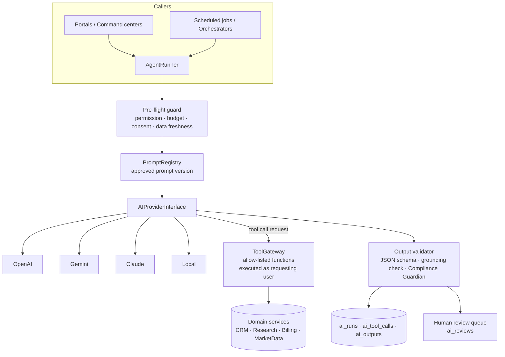
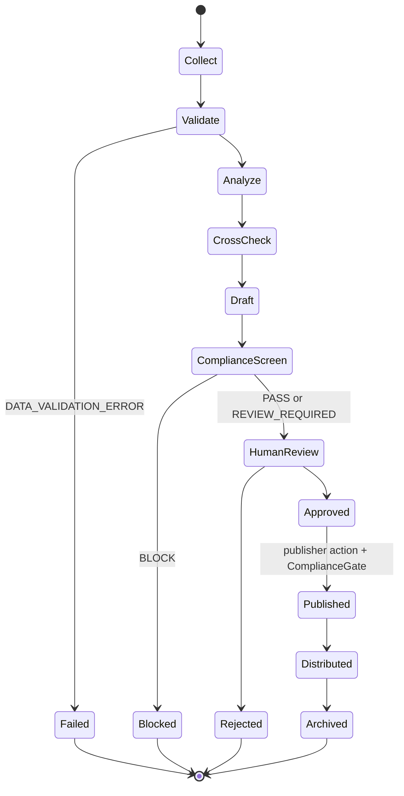

# AI Agent Architecture

AI is an **assistive** layer. It interprets, summarizes, classifies and drafts. It does not calculate core financial metrics, does not decide regulatory outcomes, does not move money, and cannot publish controlled research. The regulated entity remains responsible for every output, so every run is traceable end to end.

## 1. Layers



## 2. Provider abstraction

```php
interface AIProviderInterface
{
    public function name(): string;                       // "openai" | "gemini" | "claude" | "local"
    public function complete(AICompletionRequest $request): AICompletionResult;
    public function supportsTools(): bool;
    public function supportsJsonSchema(): bool;
    public function estimateCost(string $model, int $inputTokens, int $outputTokens): string; // decimal string
}
```

- `AICompletionRequest`: model, system prompt, messages, tool definitions, JSON schema, temperature, max tokens, `run_uuid`.
- `AICompletionResult`: content, tool calls, usage (input/output tokens), provider request ID, finish reason, latency.
- Implementations: `OpenAIProvider`, `GeminiProvider`, `ClaudeProvider`, `LocalAIProvider` (OpenAI-compatible endpoint such as vLLM/Ollama).
- `ai_models` rows map a logical model (`research-drafting-large`) to provider + model ID + pricing. Admins switch providers by editing that row (audited, requires `ai.models.manage`), never by code change.
- Failover: an agent may list an ordered fallback of `ai_models`; a failover is recorded on the run.

## 3. Agent contract

Every agent is a row in `ai_agents` plus a PHP class implementing:

```php
interface AgentDefinition
{
    public function key(): string;
    public function purpose(): string;
    public function inputSchema(): array;     // JSON Schema
    public function outputSchema(): array;    // JSON Schema
    public function allowedTools(): array;    // tool keys
    public function requiredPermission(): string;
    public function escalation(): Escalation; // when to route to a human
}
```

Configuration held in DB (versioned): prompt version, model, temperature, max tokens, budget, enabled flag.

## 4. Agent catalogue

| Agent | Purpose | Allowed tools | Output | Human gate |
|---|---|---|---|---|
| **MarketScannerAgent** | Summarize index/sector/breadth moves from computed snapshot | `get_market_snapshot`, `get_market_breadth`, `get_corporate_actions` | `MarketSummary` with cited snapshot IDs | None for internal use; publication follows research workflow |
| **TechnicalResearchAgent** | Interpret deterministic indicator outputs (RSI, EMA, MACD, ADX, ATR, VWAP, levels) | `get_indicators`, `get_price_history`, `get_levels` | `TechnicalView` (thesis, levels copied from tool output, scenarios, invalidation) | Analyst review |
| **FundamentalResearchAgent** | Interpret financial statements and ratios computed by code | `get_fundamentals`, `get_shareholding`, `get_corporate_actions` | `FundamentalView` | Analyst review |
| **OptionsResearchAgent** | Interpret OI/PCR/IV/max-pain computed by code | `get_option_chain_metrics` | `DerivativesView` | Analyst review |
| **NewsAgent** | Deduplicate and classify licensed news items | `get_news_items` | Per item: sentiment `POSITIVE/NEGATIVE/NEUTRAL/MIXED`, impact `LOW/MEDIUM/HIGH`, source URL, published & retrieved time | None (classification only) |
| **RiskAgent** | List risk factors & scenario ranges from data | `get_indicators`, `get_volatility`, `get_events_calendar` | `RiskFactors` | Analyst review |
| **ReportWriterAgent** | Assemble a report draft from the above structured views | none (receives structured inputs) | `ResearchDraft` sections | Full research workflow |
| **ComplianceGuardianAgent** | Second-pass semantic screen after rule-based screen | `get_compliance_rules`, `get_regulatory_profile` | `PASS / REVIEW_REQUIRED / BLOCK` + reasons + rule refs | `BLOCK` and `REVIEW_REQUIRED` → Compliance Admin |
| **ResearchReviewerAgent** | Consistency checks: levels in prose match tool data, disclosures present, no stale data | `get_research_version`, `get_market_snapshot` | Findings list | Analyst |
| **ClientCommunicationAgent** | Draft email/WhatsApp from approved templates and CRM facts | `get_client`, `get_invoice`, `get_subscription`, `draft_email`, `draft_whatsapp` | Draft message | Sending requires approved template + consent + (for research content) published research |
| **LeadScoringAgent** | Produce 0–100 score, grade, `lead_score_explanation` from features computed by code | `get_lead_features` | `LeadScore` | Not a prediction; shown as "AI-generated estimate" |
| **CRMAssistantAgent** | Employee assistant (priority leads, summaries, drafts, objections) | `get_my_leads`, `get_lead`, `get_lead_timeline`, `create_followup`, `draft_email`, `draft_whatsapp` | Answer + record links | `create_followup` requires user confirmation click |
| **SupportAgent** | Client chatbot for invoices, activation, documents, navigation, education | `get_my_invoices`, `get_my_subscription`, `get_my_documents_status`, `get_ticket_status`, `create_ticket`, `search_help_articles` | Answer or escalation | Any request for personalized investment advice → escalate |
| **AnalyticsAgent** | Admin BI questions | `run_metric_query` (named, parameterized metrics only) | Answer + data source + `as_of` timestamp | None (read-only) |

## 5. Tool gateway rules

1. Tools are PHP classes with typed input DTOs and JSON schemas. The model never sees SQL, file paths or shell.
2. Every tool call executes **as the requesting user** (`Gate::forUser($user)`), so the assistant can never read a record the user could not open in the UI. Scheduled agents run as a named system principal with an explicit, minimal permission set.
3. Write tools only create **drafts or tasks**. There is no tool for sending, publishing, payment changes, permission changes or deletion.
4. Every call is stored in `ai_tool_calls` (tool, arguments hash, result record IDs, duration, allowed/denied).
5. Tool results include `source` and `as_of`; empty results return the literal `Insufficient verified data.` string that prompts are instructed to surface verbatim.

## 6. Hallucination controls

| Risk | Control |
|---|---|
| Invented prices/levels | Output validator extracts every number in `levels`/`entry`/`stop`/`targets` and requires it to exist in the tool results for that run (tolerance 0). Mismatch → run `blocked`, error `AI_UNGROUNDED_NUMBER`. |
| Invented news/URLs | URLs must match a `news_items.url` returned by a tool in the same run. |
| Invented registration numbers | Guardian rule: any `IN[A-Z]\d{9}`-like token or "SEBI registration" phrase must equal the verified `regulatory_profile` value, otherwise `BLOCK`. |
| Invented client/payment facts | Client-facing drafts may only interpolate fields from tool results; free-text numbers are flagged. |
| Stale data | Pre-flight guard refuses a run if any required snapshot is older than the dataset's freshness SLA → `DATA_VALIDATION_ERROR`. |
| Overconfidence | Output schemas require `confidence` and `limitations`; UI labels all AI text "AI-generated interpretation". |

## 7. Research orchestrator



- Each step is a queued job with `tries=3`, exponential backoff (30s, 120s, 600s), and a global timeout. Exhausted jobs go to `job_failures` (dead letter) and notify admins after a configurable threshold.
- Steps are idempotent, keyed by `orchestration_run_id + step`.
- No loops: the graph is a DAG; a rejected draft ends the run and a new run must be started explicitly.

## 8. Prompt registry

`ai_prompts` + `ai_prompt_versions` (`status: draft → in_review → approved → active → retired`). Only one `active` version per prompt. Activating a prompt for a research or client-communication agent requires Compliance Admin approval per the approval matrix. Rollback = re-activate a previous approved version (audited).

## 9. Cost control

`ai_runs` stores tokens and computed cost from `ai_models` pricing at run time. `ai_budgets` define monthly limits per agent and globally; the guard refuses runs beyond the hard limit (`AI_BUDGET_EXCEEDED`) and alerts at the soft limit. Reports: cost per agent, per lead (runs linked to lead), per research report, per client.

## 10. Memory

No free-form long-term memory. "Memory" = permission-aware retrieval from structured records (preferences, consent, risk profile, interaction history) at run time. Embeddings (if used for knowledge base search) are stored per document with the document's access policy and deleted when the source is deleted.
