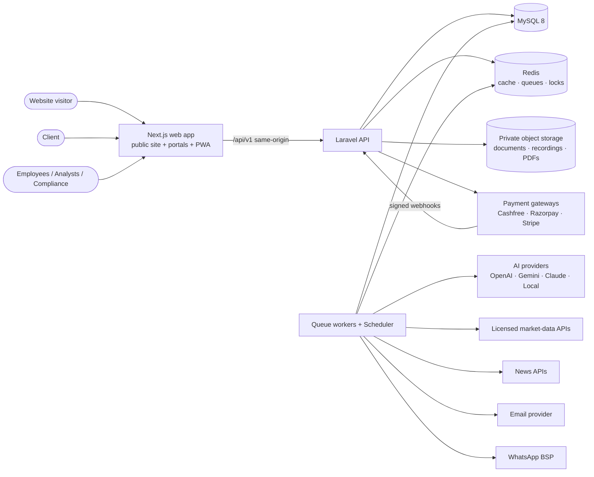
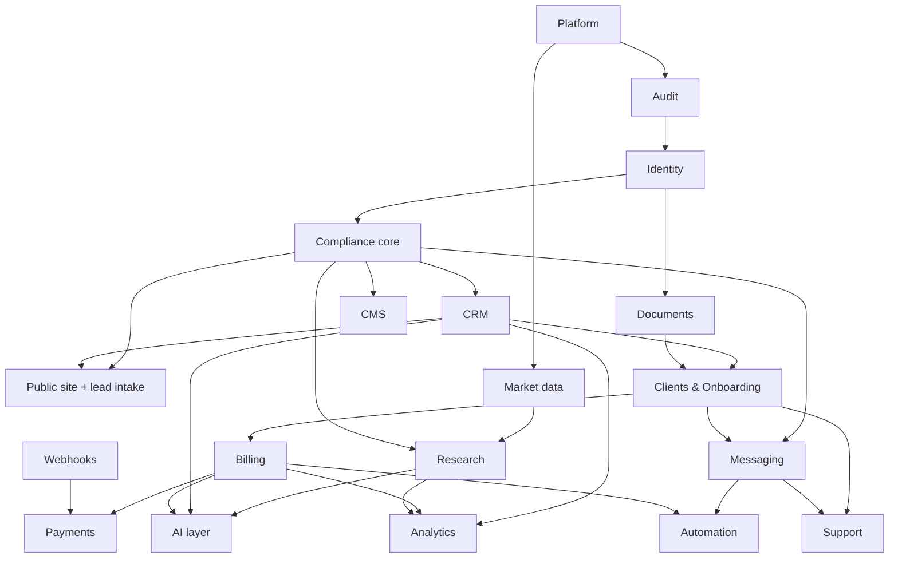

# Expert Stocks Consultancy Platform — Architecture

Status: **Phase 1 baseline** · Owner: Engineering · Last updated: 2026-09-16

Related documents:
[ERD](ERD.md) · [RBAC matrix](RBAC_MATRIX.md) · [AI agents](AI_AGENT_ARCHITECTURE.md) · [Research workflow](RESEARCH_APPROVAL_WORKFLOW.md) · [Compliance-risk matrix](COMPLIANCE_RISK_MATRIX.md) · [API](API_ARCHITECTURE.md) · [Deployment](DEPLOYMENT_ARCHITECTURE.md) · [Phase plan](PHASE_PLAN.md) · [Site audit](CURRENT_SITE_AUDIT.md)

---

## 1. Foundational principles

These are enforced in code, not just in documentation.

| # | Principle | Enforcement point |
|---|---|---|
| P1 | **Code for calculations, data sources for facts, AI for interpretation, authorized humans for controlled publication.** | Indicators live in `Domain/Research/Indicators` (deterministic, unit-tested). AI agents receive computed values and can only *draft*. Publication requires an `approval` row created by a user holding `research.approve`. |
| P2 | **Regulatory status is data, not copy.** | `regulatory_profiles` (versioned). `ComplianceGate::assertCanPublish()` refuses regulated publication when the active profile is missing, unverified or past its review date. No template contains the words "SEBI registered". |
| P3 | **Never fabricate.** | Market data carries `source`, `as_of`, `retrieved_at`; stale data raises `MARKET_DATA_STALE`. AI tools return `Insufficient verified data.` when a tool returns nothing. Payment status is written only by verified gateway webhooks or a two-person manual verification. |
| P4 | **Immutable history.** | `audit_logs`, `research_versions` (published), `payments`, `research_performance`, `consent_records`, `ai_runs` reject updates/deletes at the model layer and (in MySQL) via restricted DB grants for the app user. |
| P5 | **Explicit state machines.** | Every lifecycle (lead, onboarding, invoice, payment, subscription, research, recommendation, complaint) is a PHP enum with a transition table; illegal transitions throw `INVALID_STATE_TRANSITION`. |
| P6 | **Least privilege + record scope.** | Permission check → policy (ownership/team) → query scope. AI tools run with the *requesting user's* scope. |
| P7 | **Configurable, versioned legal content.** | Policies, disclosures, templates, prompts, risk methodology are versioned rows with `effective_from`, `review_due_at`, `approved_by`. |
| P8 | **Fail closed, never fake success.** | Jobs mark `failed` with the exact error; retries use bounded backoff; dead-letter table; admin alert on threshold. |
| P9 | **Demo data is fenced.** | `is_demo` column on business tables; global `ExcludeDemo` scope when `DEMO_MODE=false`; demo seeders refuse to run in `production`. |

## 2. System context



## 3. Containers

| Container | Tech | Responsibility |
|---|---|---|
| **web** | Next.js (App Router), TypeScript, Tailwind CSS | Public website (SSG/ISR), client portal, employee workspace, admin command center, PWA shell. No business logic; all authorization is re-checked by the API. |
| **api** | Laravel 12+, PHP 8.3, Sanctum | REST API `/api/v1`, webhooks, policies, state machines, PDF generation, audit. |
| **worker** | Laravel queue workers (Redis), Supervisor | AI runs, market-data ingestion, report drafting, email/WhatsApp dispatch, PDF rendering, automation rules. Queues: `critical` (payments/webhooks), `default`, `ai`, `comms`, `ingest`, `reports`. |
| **scheduler** | `php artisan schedule:work` (one instance, `onOneServer`) | Pre/post-market jobs, reminders, renewals, backups verification, compliance review reminders. |
| **mysql** | MySQL 8 (InnoDB, utf8mb4) | System of record. |
| **redis** | Redis 7 | Cache, queues, rate limits, locks, idempotency keys. |
| **storage** | S3-compatible private bucket (or local private disk on single VPS) | Encrypted documents, call recordings, generated PDFs. Access only via short-lived signed URLs issued after a policy check + audit entry. |

Same-origin routing: Nginx sends `/api`, `/sanctum`, `/webhooks` to PHP-FPM and everything else to Next.js. This lets Sanctum use HttpOnly, `SameSite=Lax`, `Secure` session cookies with CSRF protection and no tokens in browser storage.

## 4. Backend code layout

```
backend/
  app/
    Domain/                     # business logic, framework-light
      Audit/                    # AuditLogger, Auditable trait, masking
      Identity/                 # roles/permission catalog, 2FA, login security
      Compliance/               # RegulatoryProfile, ComplianceGate, PolicyDocuments, (Guardian later)
      Crm/                      # lead intake, attribution, dedupe (Phase 1 subset)
      Platform/                 # settings, demo mode, health, request context
      Shared/                   # StateMachine, Money, ApiError, enums
    Http/
      Controllers/Api/V1/{Auth,Public,Admin,Employee,Client}/
      Middleware/               # RequestId, SecurityHeaders, RequireTwoFactor, EnsureAccountActive
      Requests/                 # FormRequest validation
      Resources/                # API resources (field-level filtering by audience)
    Models/                     # Eloquent models
    Policies/
  database/{migrations,seeders,factories}
  routes/api.php                # versioned
  tests/{Unit,Feature}
```

Later phases add `Domain/{RiskProfile, Documents, Billing, Payments, Research, MarketData, AI, Messaging, Automation, Analytics, Cms, Support}` using the same pattern.

## 5. Module catalogue and dependency graph

| Module | Phase | Depends on |
|---|---|---|
| Platform (settings, health, demo mode, request context, errors) | 1 | — |
| Audit | 1 | Platform |
| Identity & RBAC (auth, 2FA, sessions, users, teams, employees) | 1 | Platform, Audit |
| Compliance core (regulatory profile, policy documents, consent records) | 1 | Identity, Audit |
| Public website + lead intake | 1 | Compliance core, CRM core |
| CRM (leads, assignments, activities, tasks, follow-ups, campaigns, vendors, imports) | 2 | Identity, Audit, Compliance core |
| Clients & Onboarding (risk profile, KYC documents, agreements) | 3 | CRM, Documents, Compliance |
| Documents (encrypted storage, versions, signed URLs, retention) | 3 | Identity, Audit |
| Billing (services, plans, subscriptions, invoices, receipts) | 4 | Clients, Documents |
| Payments (gateway abstraction, webhooks, allocations) | 4 | Billing, Webhooks |
| Market data (provider abstraction, snapshots, staleness) | 5 | Platform |
| Research (reports, versions, recommendations, approvals, performance, disclosures) | 5 | Market data, Compliance, Identity |
| AI layer (provider abstraction, prompt registry, runs/outputs/reviews, cost, agents) | 6 | Identity, Audit, Compliance, (tools from CRM/Research/Billing) |
| Messaging (email, WhatsApp, notifications, templates) | 7 | Compliance (consent + guardian), Clients/CRM |
| Automation (rule engine, runs, scheduler jobs) | 7 | Messaging, CRM, Billing, Compliance |
| Analytics & BI (funnels, vendor quality, churn signals, exports) | 8 | CRM, Billing, Research, Messaging |
| Support & Complaints (tickets, grievances, SLA) | 8 | Clients, Messaging |
| CMS (pages, blog, landing pages, testimonials, SEO) | 8 | Compliance guardian, Identity |
| Security hardening, Compliance Guardian, test suite completion | 9 | all |
| Observability, backups, deployment | 10 | all |



Rule: arrows point from dependency to dependent. A module may call only modules upstream of it; downstream reactions happen through domain events (e.g. `PaymentVerified` → `Billing` issues receipt → `Onboarding` evaluates activation → `Messaging` sends welcome).

## 6. Cross-cutting design

### 6.1 Request context and errors
- `RequestId` middleware accepts a valid inbound `X-Request-Id` or generates a UUIDv7, stores it in `Context`, returns it in the response header, and stamps it on every audit/log row.
- All API errors use one envelope (see [API_ARCHITECTURE.md §4](API_ARCHITECTURE.md)); stack traces never leave the server.

### 6.2 Audit
- `AuditLogger::record(action, subject, old, new, reason)` writes `audit_logs` with actor, IP, user agent, device fingerprint hash, request ID.
- `Auditable` model trait records create/update/delete diffs with sensitive attributes masked (`password`, `two_factor_secret`, PAN, bank details).
- `audit_logs` is append-only: the model throws on update/delete; production DB user has `INSERT, SELECT` only on that table.

### 6.3 State machines
`Domain/Shared/StateMachine` provides `canTransition(from, to)` and `transition(model, to, actor, reason)` which writes a `*_status_history` row plus an audit entry inside the same DB transaction.

### 6.4 Money
- Columns `DECIMAL(15,2)`; PHP uses `brick/math` `BigDecimal` (Phase 4). Totals are always recalculated server-side; client-submitted totals are ignored.

### 6.5 Versioned content pattern
`<entity>` (stable identity) + `<entity>_versions` (immutable once `approved`/`published`), with `status`, `version`, `effective_from`, `review_due_at`, `created_by`, `approved_by`, `approved_at`, `content_hash`. Editing a published version creates a new draft version.

### 6.6 Consent
`consent_records` is append-only: `(subject_type, subject_id, purpose, granted, channel, policy_version_id, consent_text_hash, ip, user_agent, captured_at)`. Current consent = latest row per purpose. All outbound communications check it.

### 6.7 Demo mode
`DEMO_MODE` env flag. Tables with business data have `is_demo`. `DemoScope` excludes demo rows when demo mode is off; analytics always exclude them. `DemoSeeder` aborts when `APP_ENV=production`.

### 6.8 Security baseline
Argon2id password hashing; login throttling per account+IP with progressive lockout; TOTP 2FA mandatory for staff roles flagged `requires_2fa`; session listing and revocation; login history; security headers + CSP; encrypted `api_credentials` (Laravel encrypter with dedicated key); signed download URLs; file-type sniffing; ClamAV hook for uploads (Phase 3).

## 7. Key lifecycles (summary)

| Object | States |
|---|---|
| Lead | `NEW → NPC / CALL_BACK / FOLLOW_UP → FREE_TRIAL → PAID → CONVERTED`; terminal `NOT_INTERESTED`, `DND`, `INVALID`, `LOST` |
| Onboarding | `LEAD → QUALIFIED → CONSENTED → RISK_PROFILED → DETAILS_CAPTURED → KYC_SUBMITTED → AGREEMENT_ACCEPTED → PLAN_SELECTED → INVOICED → PAID_VERIFIED → COMPLIANCE_CLEARED → ACTIVE` |
| Payment | `INITIATED, PENDING, SUCCESS, FAILED, CANCELLED, REFUNDED, PARTIAL, UNDER_REVIEW` |
| Research report | `DRAFT → AI_REVIEW → COMPLIANCE_REVIEW → ANALYST_REVIEW → APPROVED → PUBLISHED → EXPIRED/ARCHIVED`; `REJECTED` from any review |
| Recommendation | `DRAFT → UNDER_REVIEW → APPROVED → PUBLISHED → EXPIRED/CANCELLED/CLOSED → ARCHIVED` |

Detailed diagrams: [RESEARCH_APPROVAL_WORKFLOW.md](RESEARCH_APPROVAL_WORKFLOW.md).

## 8. Technology decisions

| Decision | Choice | Reason |
|---|---|---|
| Backend | Laravel 12+ / PHP 8.3 | Mature queues, scheduler, policies, Sanctum; VPS-friendly |
| RBAC | `spatie/laravel-permission` + policies + query scopes | Battle-tested role/permission storage; record scope handled in policies |
| 2FA | TOTP (`pragmarx/google2fa`) + hashed recovery codes | Works offline with any authenticator app |
| Frontend | Next.js + TypeScript + Tailwind | SSG for SEO pages, one codebase for portals, PWA support |
| Auth transport | Sanctum SPA cookies, same origin | HttpOnly cookies, CSRF protection, no tokens in JS |
| Integration auth | Sanctum personal access tokens with abilities + expiry | Vendors/partners and future mobile app |
| Local dev DB | SQLite | Zero-install; migrations kept MySQL-compatible, CI runs against MySQL |
| PDF | `spatie/browsershot` or `dompdf` (Phase 3) | HTML templates, hashable output |
| Queue | Redis + Supervisor (Horizon optional) | Simple on a VPS |
| AI | `AIProviderInterface` with per-agent model config in DB | Provider-agnostic; switchable by admin |
