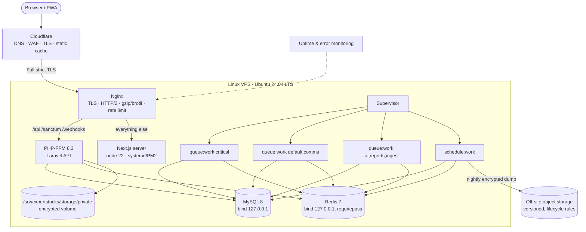

# Deployment Architecture

## 1. Target topology (single VPS, scale-out ready)



Scale-out path: move MySQL to a managed instance, storage to S3-compatible bucket, add a second app node behind Cloudflare load balancing; workers scale independently per queue.

## 2. Environments

| Env | Purpose | Data | `DEMO_MODE` |
|---|---|---|---|
| local | Development | SQLite or Docker MySQL, demo seeders | true |
| staging | UAT, compliance review of copy/templates | Demo + anonymised | true |
| production | Live | Real only; demo seeders refuse to run | false |

## 3. Directory layout on server

```
/srv/expertstocks/
  releases/<timestamp>/{backend,frontend}
  current -> releases/<timestamp>
  shared/backend/.env
  shared/backend/storage/        # logs, framework cache, private documents
  backups/                       # local staging area before off-site upload
```

Zero-downtime deploy: build in new release dir → `composer install --no-dev -o` → `npm ci && npm run build` → `php artisan migrate --force` (backwards-compatible migrations only) → `config:cache route:cache event:cache` → switch symlink → `php-fpm reload` → `queue:restart` → restart Next.js → smoke tests (`/api/v1/health`, home page) → auto-rollback symlink on failure.

## 4. Security hardening

- SSH keys only, non-root deploy user, `ufw` allowing 22 (restricted), 80, 443; fail2ban for SSH and Nginx auth endpoints.
- Cloudflare origin certificate + authenticated origin pulls; Nginx only accepts Cloudflare IP ranges.
- MySQL: separate users — `app_rw` (no DROP/ALTER; `INSERT,SELECT` only on append-only tables), `app_migrate` (used only during deploy), `backup_ro`.
- Secrets in `shared/.env` (0600); API credentials in DB encrypted with a dedicated key; key rotation runbook.
- PHP: `expose_php=Off`, `disable_functions` for exec family in FPM pool, `open_basedir`.
- Private storage outside web root; downloads via signed, 5-minute URLs.
- Automatic security updates (`unattended-upgrades`), monthly dependency audit (`composer audit`, `npm audit`).

## 4b. PHP-FPM settings that matter

| Setting | Value | Why |
|---|---|---|
| `memory_limit` | 512M | PDF rendering (risk reports, later invoices and receipts) exceeds the 128M default. |
| `upload_max_filesize` / `post_max_size` | ≥ the configured `DOCUMENT_MAX_SIZE_KB` (default 10 MB) plus overhead | Client KYC uploads are rejected by PHP before Laravel sees them otherwise. |
| `max_execution_time` | 60 | Report generation and CSV import batches. |
| `opcache.enable` / `opcache.validate_timestamps=0` | on / off in production | Re-enable validation or restart FPM on deploy. |

Document storage: `DOCUMENT_DISK` (default `local`, i.e. `storage/app/private`) must be on encrypted-at-rest storage and excluded from any world-readable path; contents are additionally encrypted with the application key when `DOCUMENT_ENCRYPT_AT_REST=true`. Rotating `APP_KEY` therefore requires re-encrypting stored documents — plan it with a maintenance window.

## 5. Backups & restore

| Item | Schedule | Method | Retention |
|---|---|---|---|
| MySQL full | Daily 01:30 IST | `mysqldump --single-transaction` → `zstd` → `age` encryption → off-site | 35 daily, 12 monthly |
| MySQL binlog (incremental) | Continuous, shipped hourly | binlog copy → encrypt → off-site | 7 days |
| Private documents | Daily incremental | `restic` (encrypted, deduplicated) → off-site | 90 days + monthly |
| `.env` + keys | On change | Encrypted to separate vault | Indefinite |

`backup_runs` records size, checksum, and upload confirmation. A weekly job restores the latest dump into a scratch database, runs row-count and checksum assertions, and records `verified_restore_at`. The admin dashboard shows a red alert if the last verified restore is older than 8 days — a "success" exit code alone never counts as a verified backup.

## 6. Observability

- Logs: JSON (Monolog) with `request_id`, shipped to central store (Loki/Better Stack/ELK); channels: `app`, `security`, `payments`, `webhooks`, `ai`, `research`, `compliance`, `comms`.
- Health: `/api/v1/health` (liveness), `/api/v1/admin/system/health` (DB, Redis, queue lag, scheduler heartbeat, storage, provider pings, SSL expiry, last backup verification).
- Metrics: API latency p50/p95, queue latency per queue, failed jobs, AI cost/day, email/WhatsApp delivery rates, webhook failure rate.
- Alerts: error-rate spikes, queue lag > 5 min on `critical`, scheduler heartbeat missing > 3 min, backup verification stale, SSL < 14 days, AI budget soft limit.

## 7. Local development

```bash
# backend
cd backend && cp .env.example .env && php artisan key:generate
php artisan migrate --seed          # sqlite by default
php artisan serve --port=8000

# frontend (proxies /api and /sanctum to :8000)
cd frontend && npm install && npm run dev
```

A `docker-compose.yml` (MySQL, Redis, Mailpit) is provided in `deploy/` for parity testing.
