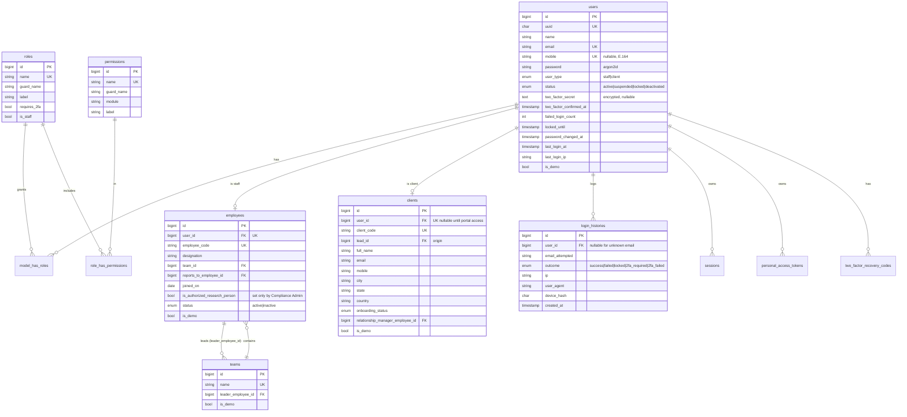
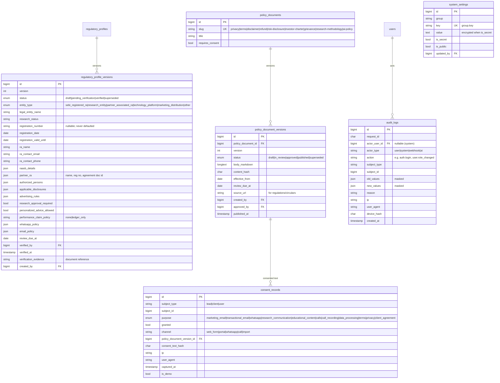
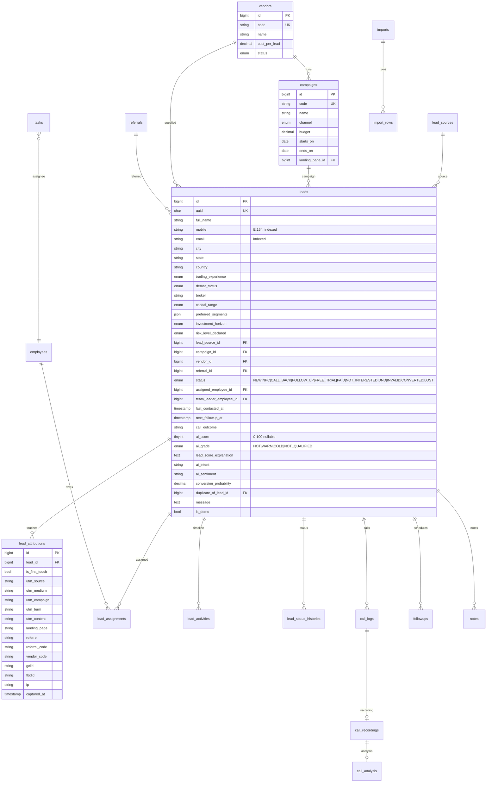
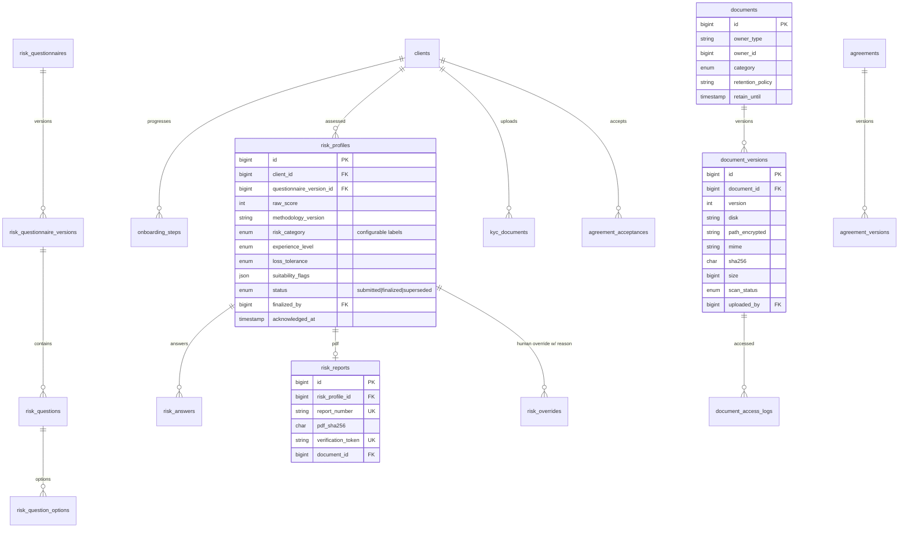
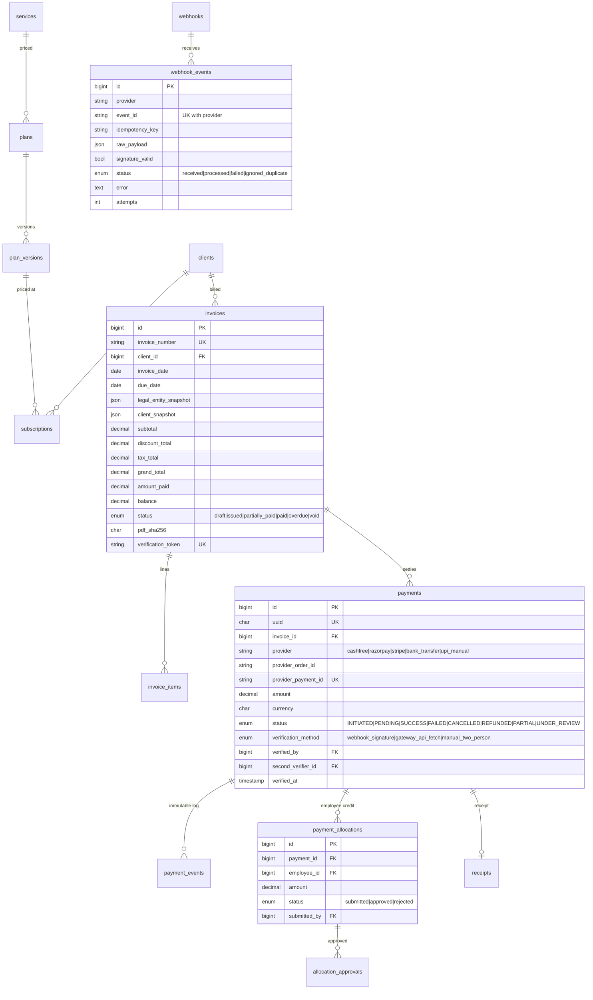
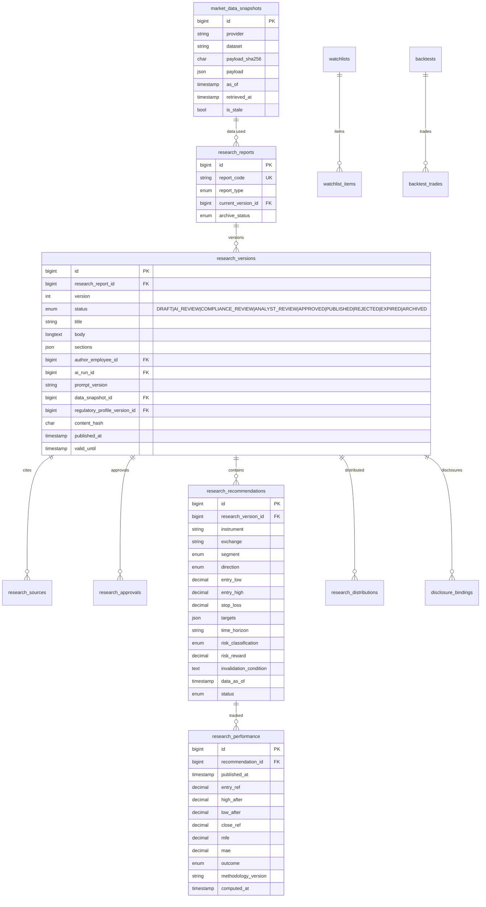
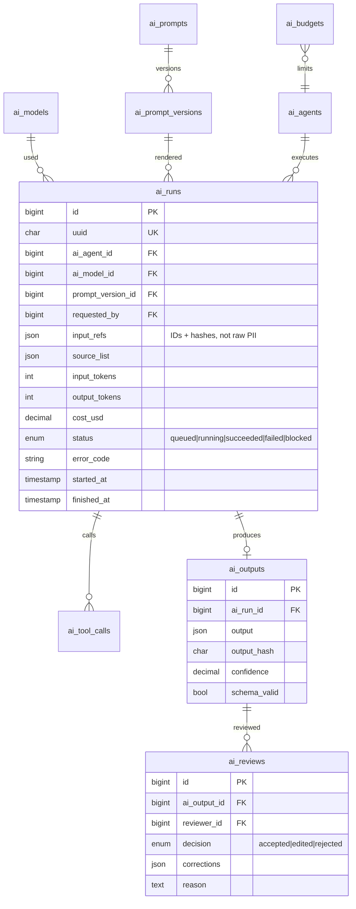
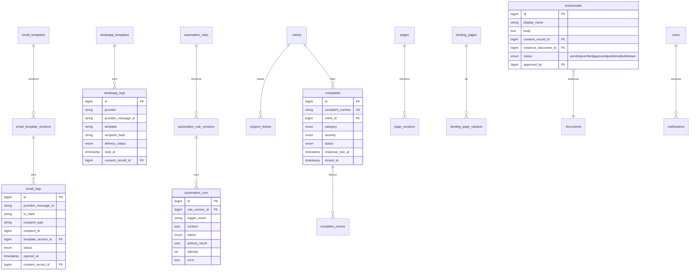

# Entity Relationship Design

Conventions applied to every table unless stated:

- `id BIGINT UNSIGNED` primary key; public-facing identifiers use a separate `uuid CHAR(36)` or formatted number (`INV-2026-000123`).
- `created_at`, `updated_at` timestamps (UTC). Display timezone `Asia/Kolkata`.
- Business tables carry `is_demo BOOLEAN DEFAULT 0` and, where deletion is allowed, `deleted_at` (soft delete).
- Money: `DECIMAL(15,2)`; quantities/prices of instruments: `DECIMAL(18,4)`; percentages: `DECIMAL(9,4)`.
- **Append-only** tables (marked 🔒) have no `updated_at`/`deleted_at` semantics; the model throws on update/delete.
- **Versioned** tables (marked 🗂) follow the entity + `_versions` pattern.
- Phase in which a table is created is shown as `P1…P10`.

---

## 1. Identity, RBAC, organisation (P1)

## 2. Audit, platform, compliance core (P1) 🔒🗂

## 3. CRM & marketing (P1 subset, completed P2)

## 4. Onboarding, risk profile, documents (P3)

## 5. Billing & payments (P4) 🔒

## 6. Research, market data, performance (P5) 🔒🗂

## 7. AI layer (P6) 🔒🗂

## 8. Messaging, automation, support, CMS, analytics (P7–P8)

## 9. Operations (P9–P10)

`error_logs`, `job_failures` (dead-letter), `health_checks`, `backup_runs` (with `verified_restore_at`), `api_credentials` (encrypted, rotation dates), `approval_matrix` (object type → required permission(s) and count), `exports`, `data_subject_requests` (export/deletion workflow), `retention_policies`.

## 10. Index strategy (highlights)

| Table | Index | Purpose |
|---|---|---|
| `leads` | `(mobile)`, `(email)`, `(status, next_followup_at)`, `(assigned_employee_id, status)`, `(campaign_id)`, `(vendor_id)`, `(created_at)` | Dedupe, work queues, attribution reports |
| `audit_logs` | `(subject_type, subject_id, created_at)`, `(actor_user_id, created_at)`, `(action, created_at)` | Timelines and investigations |
| `consent_records` | `(subject_type, subject_id, purpose, captured_at)` | Latest consent lookup |
| `login_histories` | `(user_id, created_at)`, `(ip, created_at)` | Security review |
| `payments` | `UK(provider, provider_payment_id)` | Duplicate-webhook protection |
| `webhook_events` | `UK(provider, event_id)` | Replay protection |
| `research_versions` | `UK(research_report_id, version)`, `(status, published_at)` | Immutability + feeds |
