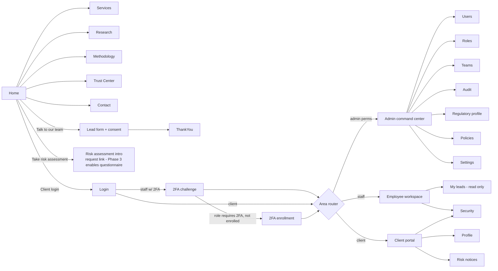

# Phase Plan

## Phase 6–10 status — AI intelligence, communications, SEBI grievance desk, health monitoring, and production deployment delivered 2026-09-28

| Phase / Deliverable | State | Where |
|---|---|---|
| **Phase 6: AI Assistive Layer & Compliance Guardian** — Provider abstraction (`MockAIProvider`, `OpenAIProvider`, `AnthropicProvider`, `GeminiProvider`), prompt registry, permission-gated `ToolGateway`, `ComplianceGuardian` semantic grounding validator (zero ungrounded numbers, SEBI RA registration string validation, prohibited promise blocking), `ai_runs` & `ai_tool_calls` audit ledger, Filament `AiRunResource` | Done | `backend/app/Domain/Ai/`, `tests/Feature/AiIntegrationTest.php` |
| **Phase 7: Communications Engine & Consent Gate** — Message template versioning & approval SoD, `NotificationService` fail-closed SEBI consent gate (`ConsentRecord::where('channel', $channel)->where('granted', true)`), transactional dispatch (email/WhatsApp), `message_logs` audit trail | Done | `backend/app/Domain/Communications/`, `tests/Feature/CommunicationsTest.php` |
| **Phase 8: SEBI Grievance Redressal & Support Tickets** — Statutory grievance mechanism with automated 21-day SLA countdown, category mapping, grievance officer assignment & resolution notes, SEBI SCORES / SMART ODR escalation integration; client portal support tickets & message threading, Filament `GrievanceResource` and `SupportTicketResource` | Done | `backend/app/Domain/Support/`, `frontend/src/app/(app)/portal/support/`, `tests/Feature/GrievanceAndSupportTest.php` |
| **Phase 9: Deep Health Monitoring & Hardening** — Authenticated deep system diagnostics (`/api/v1/admin/system/health`) checking MySQL, Redis, private vault disk writeability, regulatory profile status; rate limiting, HSTS & security headers | Done | `backend/app/Http/Controllers/Api/V1/Admin/SystemHealthController.php` |
| **Phase 10: Production Deployment Automation** — Automated Ubuntu 24.04 VPS provisioning (`deploy/setup-vps.sh`), zero-downtime release switching (`deploy/deploy.sh`), automated daily backups with scratch restore verification (`deploy/backup-restore.sh`), health verifier (`deploy/production-verify.sh`), production `.env` templates, and comprehensive `docs/PRODUCTION_OPERATIONS_MANUAL.md` | Done | `deploy/`, `docs/PRODUCTION_OPERATIONS_MANUAL.md` |
| Tests | 167 feature tests (1,406 assertions) passing with 100% green exit code; Next.js 37 routes compiling clean with 0 TypeScript/build errors | `tests/Feature/` |

## Phase 5 status — Market data, research approval workflow, compliance gate and distribution delivered 2026-09-20

| Deliverable | State | Where |
|---|---|---|
| Market data provider abstraction, quote/historical OHLCV DTOs, and staleness detection (`is_stale`, `MARKET_DATA_STALE`) | Done | `backend/app/Domain/MarketData/`, `config/market_data.php` |
| Deterministic, pure-PHP technical indicators (SMA, EMA, RSI, MACD, ATR, Bollinger Bands, Supertrend) with mathematical unit tests | Done | `backend/app/Domain/Research/Indicators/`, `tests/Feature/IndicatorTest.php` |
| Research schemas & immutable models: reports, versions, recommendations, approvals, disclosure bindings, performance ledger, distributions | Done | `backend/database/migrations/2026_09_20_100000_create_research_and_market_data_tables.php`, `backend/app/Models/*` |
| Research workflow state machine: `DRAFT -> AI_REVIEW -> COMPLIANCE_REVIEW -> ANALYST_REVIEW -> APPROVED -> PUBLISHED`, fail-closed `ComplianceGate::assertCanPublish()`, Separation of Duties (author cannot approve, approver must be `is_authorized_research_person`), cryptographic content hashing | Done | `backend/app/Domain/Research/ResearchWorkflowService.php`, `tests/Feature/ResearchWorkflowTest.php` |
| Statutory disclosure engine: binds active SEBI registration details, analyst conflict declarations, and computes immutable SHA-256 fingerprint | Done | `backend/app/Domain/Research/DisclosureEngine.php` |
| Automated performance ledger: tracking MFE, MAE, stop loss & target hits across price ticks, scheduled CLI command | Done | `backend/app/Domain/Research/PerformanceLedgerService.php`, `php artisan research:track-performance` |
| Suitability & subscription-gated distribution engine: filters research reports to clients with active subscriptions and matching risk profiles | Done | `backend/app/Domain/Research/ResearchDistributionService.php` |
| Filament v5 Back-Office Resources: `ResearchReportResource` (state transitions, audit logs, live approval actions, preview) and `MarketDataSnapshotResource` | Done | `backend/app/Filament/Resources/ResearchReports/`, `backend/app/Filament/Resources/MarketDataSnapshots/` |
| Client Portal Research Desk: REST API (`/api/v1/client/research`, `/api/v1/client/research/{uuid}`) and responsive Next.js research portal with live suitability matching and statutory disclosure drawer | Done | `backend/app/Http/Controllers/Api/V1/Client/ResearchController.php`, `frontend/src/app/(app)/portal/research/page.tsx` |
| Tests | 18 Phase 5 feature tests (111 assertions) passing with 100% green exit code | `IndicatorTest`, `MarketDataTest`, `ResearchWorkflowTest`, `PerformanceLedgerTest`, `ResearchDistributionTest`, `PortalResearchTest`, `OfficeResearchTest` |

## Phase 2 status — CRM core delivered 2026-09-17

Built on reused components after the evaluation in [REUSE_EVALUATION.md](REUSE_EVALUATION.md) and the review of the earlier CRM in [STOCKIDEACRM_REVIEW.md](STOCKIDEACRM_REVIEW.md).

| Deliverable | State | Where |
|---|---|---|
| Staff back-office on **Filament v5** at `/office`, sharing the Phase 1 sign-in, lockout and 2FA | Done | `app/Providers/Filament/OfficePanelProvider.php`, `EnsureOfficeSessionIsSecure` |
| Lead lifecycle state machine incl. `EXPECTED_PAYMENT`; `PAID`/`CONVERTED` system-only | Done | `Domain/Crm/LeadStatus.php`, `LeadWorkflowService` |
| Call logging with outcome → status mapping, NPC attempt count | Done | `LeadWorkflowService::logCall` |
| Follow-ups: schedule, complete, cancel; reminders and missed sweep every 5 min | Done | `FollowupMonitor`, `crm:followups-sweep` |
| Do-not-disturb withdraws contact consents and cancels follow-ups; only compliance can lift | Done | `LeadWorkflowService` |
| Assignment: manual within scope, workload-based auto-assignment (off by default), duplicates follow owner | Done | `LeadAssignmentService` |
| Unified append-only lead timeline and ownership history | Done | `lead_activities`, `lead_assignments` |
| CSV import with column mapping, consent basis per file, vendor consent gate, duplicate flagging, failed-row report, rollback of untouched rows | Done | `LeadImporter`, `ImportRollbackService` |
| Lead export (permission-gated) | Done | `LeadExporter` |
| Campaigns with conversion metrics and tracking links; vendors with evidence-based quality metrics; lead sources; referral codes (rewards disabled) | Done | `Filament/Resources/*` |
| Tasks, objection scripts (approval by a second person), status playbook, tip of the day, dashboard widgets | Done | ported from stockideacrm with compliance wording |
| Tests | 79 backend tests (unit + Livewire panel tests) | `tests/Feature/CrmWorkflowTest.php`, `OfficePanelTest.php` |

**Still open for Phase 2b:** `crm:import-stockideacrm` data migration once a database export is available; targets and leaderboards (deferred to Phase 4, because they must count verified payments); MySQL CI run.

## Phase 4 status — services, invoices, payments and subscriptions, delivered 2026-09-19

| Deliverable | State | Where |
|---|---|---|
| Money as integer paise everywhere, with half-up rounding stated explicitly and Indian formatting; no float touches an amount | Done | `Domain/Billing/Money.php` |
| Services, plans and **versioned prices**: a published price is frozen, so an invoice always points at what was in force | Done | `plan_versions`, `PlansRelationManager` |
| Invoices calculated server-side from the stored price and tax code, gap-free numbering per financial year, entity and client snapshots at issue, immutable once issued, void needs a reason and is refused after money is received | Done | `InvoiceService`, `NumberSeries` |
| Payments: recorded by one person, verified by another (configurable), proof required for non-cash, append-only event trail, refunds reverse what they activated | Done | `PaymentService`, `payment_events` |
| Subscriptions start **only** when a verified payment settles the invoice; a refund pauses them; daily sweep expires finished ones and reminds staff before renewal | Done | `SubscriptionService`, `BillingSweeper`, `billing:sweep` |
| Selling is blocked until onboarding is complete | Done | `SubscriptionService::create` |
| Invoice and receipt PDFs with verification QR and file checksum, filed in the vault; one public check (`/verify/{token}`) covers risk reports, invoices and receipts and shows no personal data | Done | `BillingDocumentService`, `DocumentVerifier` |
| Back-office: services & prices, invoices, payments (verify/reject/refund/receipt/credit), subscriptions; selling from the client record | Done | `app/Filament/Resources/{Services,Invoices,Payments,Subscriptions}` |
| Client portal: services, invoices, payments and downloadable receipts | Done | `Api/V1/Client/BillingController`, `frontend/src/app/(app)/portal/billing` |
| Tests | 19 new tests (arithmetic, numbering, activation gate, separation of duties, refunds, PDFs, scoping, panel flows) | `BillingTest`, `OfficeBillingTest`, `PortalOnboardingTest` |

| Payment gateways behind one interface (Cashfree, Razorpay); each stays off until its flag **and** credentials are set, so a half-configured provider cannot take live money | Done | `Domain/Billing/Gateways/*` |
| Webhook intake: signature checked against the raw body, every event stored before it is acted on and keyed by the provider's event id, so replays are no-ops; unsigned, unknown and unmatched events are kept for inspection and never move money | Done | `WebhookProcessor`, `webhook_events`, `POST /api/v1/webhooks/payments/{provider}` |
| Client can start an online payment for an open invoice; the signed callback — not the browser — settles it | Done | `BillingController::payInvoice` |
| Payment credit: submitted from a payment, approved by a second person, never more than the payment, and stops counting the moment the payment is refunded | Done | `AllocationService`, `AllocationResource` |

**Still open for Phase 4b:** credit-note documents; targets and leaderboards built on approved credit; dunning emails (waits for the consent-aware engine in Phase 7); a live sandbox run against each provider once credentials exist.

## Phase 3 status — onboarding, risk profiling and the document vault, delivered 2026-09-18

| Deliverable | State | Where |
|---|---|---|
| Versioned risk questionnaires (questions, weighted options, configurable bands); published versions are frozen so an assessment can always be reproduced | Done | `risk_questionnaire_versions`, `RiskQuestionnaireResource` |
| Deterministic scoring: same answers → same score, band and answers hash; no model, no estimate; required questions enforced | Done | `RiskProfileService::score` |
| Assessments are immutable and supersede the previous one; client acknowledgement required before sign-off; category override only with a written reason, recorded append-only next to the computed score | Done | `RiskProfileService`, `risk_overrides` |
| Document vault: private disk, encrypted at rest, versioned, re-uploading re-opens verification, short-lived signed download links, every upload/view/download/link logged | Done | `DocumentVault`, `document_access_logs`, `routes/web.php` |
| KYC checks: configurable types and formats, identity numbers stored masked plus a keyed hash (never in the clear, never in the audit log), duplicate-number detection, verification by a second role | Done | `KycService`, `kyc_checks` |
| Onboarding state machine with a checklist derived from the record; activation refused while a required step is open; optional steps skippable with a reason | Done | `OnboardingService`, `config/onboarding.php` |
| Client agreements: versioned text, approval by someone other than the author, publication, append-only acceptance evidence (text hash, method, IP) plus a consent record | Done | `AgreementService`, `agreement_acceptances` |
| Lead → client conversion creating the client record, checklist and lead timeline entry; never implies payment | Done | `ClientConversionService`, lead action **Convert to client** |
| Back-office: Clients list (own → team → all), client view with checklist, risk, KYC, documents and agreements; compliance screens for questionnaires and agreements | Done | `app/Filament/Resources/{Clients,RiskQuestionnaires,Agreements}` |
| Tests | 26 new tests (domain determinism/immutability, encryption, access logging, masking, SoD, activation gate, panel flows) | `OnboardingTest`, `OfficeClientsTest`, `OfficeQuestionnaireTest` |

| Risk-profile PDF report issued on sign-off: report number, answers hash, file SHA-256, verification QR, disclosures; filed in the vault; public verification page shows no personal data and flags superseded copies | Done | `RiskReportGenerator`, `resources/views/pdf/risk-report.blade.php`, `/verify/risk-report/[token]` |
| Client portal: onboarding checklist, accept agreements, upload documents (and open them through signed links), take and acknowledge the risk questionnaire | Done | `Api/V1/Client/OnboardingController`, `frontend/src/app/(app)/portal/{onboarding,risk-profile}` |

**Still open for Phase 3b:** retention sweep job for `retain_until`; optional virus scanning hook (`document_versions.scan_status` is already carried); counter-signed agreement PDFs.

## Phase 2b status — back-office completion delivered 2026-09-18

| Deliverable | State | Where |
|---|---|---|
| Admin screens moved out of Next.js into the panel: users (create, roles, unlock, research authorisation, deactivate), teams, roles (read-only), audit log, login history, system settings, regulatory profile, policy documents | Done | `app/Filament/Resources/{Users,Teams,Roles,AuditLogs,LoginHistories,SystemSettings,RegulatoryProfiles,PolicyDocuments}` |
| Stale-lead escalation: NEW not contacted within `crm.escalation_new_hours`, open leads idle beyond `crm.escalation_idle_hours` with no follow-up due; notifies owner and team leader (unassigned ones go to managers); clears automatically when anyone works the lead | Done | `LeadEscalationService`, `crm:escalate-stale-leads` (every 15 min) |
| Training gate: versioned modules per role, mandatory modules block the rest of the back-office until acknowledged; acknowledgements are append-only; editing published content bumps the version and re-asks | Done | `TrainingService`, `TrainingModuleResource`, `EnforceWorkforcePolicies` |
| Attendance from back-office activity (first/last request, active minutes with an idle cut-off), scoped own → team → all; labelled as presence in the system, not hours worked | Done | `WorkforceClock`, `AttendanceDayResource` |
| Optional office-hours enforcement (`workforce.enforce_office_hours`, days and window configurable; admins exempt) | Done | `WorkforceClock::blocksAccess` |
| Tests | 6 workforce/escalation tests on top of the Phase 2 suite | `tests/Feature/WorkforceTest.php`, `OfficeAdminTest.php` |

## Phase 1 status — delivered 2026-09-17

| Deliverable | State | Evidence |
|---|---|---|
| Site audit, architecture, ERD, RBAC matrix, AI agents, research workflow, compliance-risk matrix, API, deployment docs | Done | `docs/` |
| Schema: identity, audit, settings, regulatory profile, policies, consent, CRM core | Done | `backend/database/migrations` (SQLite-verified; MySQL run pending) |
| RBAC: 19 roles, 102 permissions, record scopes, separation of duties | Done | `config/rbac.php`, `RoleAssignmentService`, `Lead::scopeVisibleTo` |
| Auth: session login, lockout, TOTP 2FA + recovery codes, sessions, login history | Done | `AuthController`, `AccountController` |
| Audit trail (append-only, masked) | Done | `AuditLogger`, `AppendOnly` |
| Regulatory profile + publication gate; versioned policies | Done | `RegulatoryProfileService`, `ComplianceGate`, `PolicyDocumentService` |
| Lead intake with consent, attribution, duplicates, honeypot, rate limits | Done | `LeadIntakeService` |
| Public website (19 routes + legal pages), Trust Center, SEO, cookie consent | Done | `frontend/src/app/(site)` |
| Admin command center, employee workspace, client portal shells | Done | `frontend/src/app/(app)` |
| Tests | 52 backend feature tests passing; frontend type-check, lint, production build passing; browser flows verified (lead capture, 2FA enrollment, 2FA challenge, scoped leads, admin pages, 375px layout) | |

**Carried into Phase 2:** run migrations and tests against MySQL 8 in CI; frontend component/E2E tests (Playwright); PWA offline drafts (manifest shipped, service worker not yet); OpenAPI served from the app (`docs/openapi/openapi.yaml` is hand-maintained for now); `research.approve` authorized-person check wired into the Phase 5 research service.

| Phase | Scope | Exit criteria |
|---|---|---|
| **1** | Architecture docs, Phase-1 schema, RBAC, authentication (session + TOTP 2FA + lockout + login history + sessions), audit log, regulatory profile & policy versioning, consent records, public lead intake, admin/employee/client shells, public website | All Phase-1 feature tests green; public site renders only verified regulatory wording; no fake data outside demo seeders |
| 2 | CRM: leads (full fields), statuses, assignment rules, activities timeline, tasks, follow-ups, campaigns, vendors, referrals, CSV import with rollback, duplicate detection | Lead lifecycle tests; team scoping tests; import rollback test |
| 3 | Risk profile (versioned questionnaire, deterministic scoring, PDF + QR + hash), documents (encrypted, signed URLs), KYC, agreements, onboarding state machine | Risk scoring determinism tests; document access tests |
| 4 | Services, plans, subscriptions, invoices (server-side totals, PDF), payments abstraction (Cashfree/Razorpay/Stripe/manual), webhooks, receipts, allocations, activation engine, renewals | Duplicate webhook, payment-without-activation, manual-verification SoD tests |
| 5 | Market-data providers + snapshots + staleness, deterministic indicators, research reports/versions/recommendations, approval workflow, disclosure engine, distribution, performance ledger, backtesting lab | Publication gate tests; immutability tests; stale data tests |
| 6 | AI provider abstraction, prompt registry, agents, tool gateway, grounding validator, cost tracking, CRM/research/admin assistants, lead scoring, call analysis | Hallucination tests (ungrounded numbers/URLs/registration) |
| 7 | Email + WhatsApp engines, templates, notification center, automation rule engine & visual builder, scheduled jobs | Consent-gated sending tests; automation cannot bypass approval tests |
| 8 | Analytics/BI, vendor quality, churn signals, exports, complaints & grievance dashboard, support tickets, CMS/blog/landing pages/testimonials | Export permission tests |
| 9 | Compliance Guardian, security hardening, penetration test fixes, full test matrix, load tests | Critical test cases (§71) all automated |
| 10 | Deployment automation, monitoring, backup/restore verification, manuals and guides | Production launch checklist (§115) signed off |

---

# Phase 1 — Design

## 1. Architecture

See [ARCHITECTURE.md](ARCHITECTURE.md). Phase 1 delivers the Platform, Audit, Identity, Compliance-core and Public modules, plus shells for the three portals.

## 2. Database changes (migrations)

| Migration | Tables |
|---|---|
| users (extended) | `users`, `password_reset_tokens`, `sessions` |
| sanctum | `personal_access_tokens` |
| permission | `roles` (+`label`, `requires_2fa`, `is_staff`), `permissions` (+`module`, `label`), pivots |
| identity | `teams`, `employees`, `clients`, `login_histories`, `two_factor_recovery_codes` |
| audit | `audit_logs` 🔒 |
| platform | `system_settings` |
| compliance | `regulatory_profile_versions`, `policy_documents`, `policy_document_versions`, `consent_records` 🔒 |
| crm-core | `lead_sources`, `campaigns`, `vendors`, `leads` (full column set), `lead_attributions` 🔒, `lead_status_histories` 🔒 |

## 3. API contract

Phase 1 endpoints: [API_ARCHITECTURE.md §6](API_ARCHITECTURE.md). OpenAPI: `docs/openapi/openapi.yaml`.

## 4. UI flows

Dashboards show real counts for implemented modules. Modules not yet delivered render a neutral "Not enabled yet" state — never placeholder numbers.

## 5. Security considerations

- Session fixation: session regenerated on login and on 2FA completion.
- 2FA enforcement for roles flagged `requires_2fa` (all staff roles with access to client PII, research approval, payments, compliance, admin). Until enrolled, the user can reach only enrollment endpoints.
- Lockout: counter per account; locked accounts return `ACCOUNT_LOCKED` without revealing whether the password was right.
- Enumeration: login failure message identical for unknown email and wrong password; timing equalized with a dummy hash check.
- Privilege escalation: users cannot modify their own roles; privileged roles assignable only by Super Admin; last Super Admin cannot be removed.
- Audit: every auth event, role change, settings change, regulatory/policy change.
- Public lead endpoint: honeypot, rate limit, consent required, no reflection of whether a lead already exists.
- Headers: CSP, HSTS (prod), X-Frame-Options DENY, Referrer-Policy strict-origin-when-cross-origin, Permissions-Policy.

## 6. Tests (Phase 1)

| Area | Tests |
|---|---|
| Auth | login success; wrong password; unknown email same message; lockout after 5; locked account refuses correct password; logout; inactive user refused |
| 2FA | enrollment + confirm; challenge required at login; wrong code; recovery code single-use; staff with `requires_2fa` blocked from admin until enrolled |
| RBAC | client cannot access admin/employee APIs; business advisor cannot list users; admin cannot grant Super Admin; user cannot change own roles; last Super Admin protected |
| Scope | employee sees only own leads; team leader sees team leads; client dashboard shows only own record |
| Audit | login writes audit; role change writes old/new; audit log update/delete throws; secrets masked |
| Compliance | trust center hides unverified profile; verify by creator refused; publication gate fails without verified profile; policy publish supersedes previous; unpublished policy not public |
| Leads | creates lead + attribution + consent; consent required; honeypot silently drops; duplicate mobile links `duplicate_of_lead_id`; rate limit |
| Errors | validation envelope; 404 envelope; request ID echoed; no stack trace in production mode |
| Demo | demo seeder refuses in production; demo rows excluded from dashboard counts |
