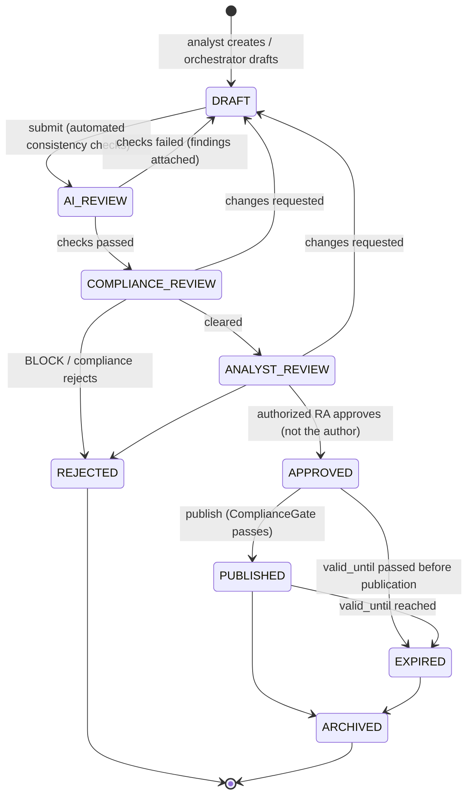
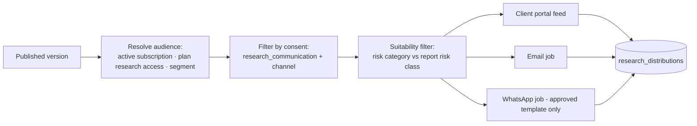

# Research Approval Workflow

## 1. States

A published version is **immutable**. Corrections create version `n+1` which goes through the same workflow; the old version is marked superseded and retains its publication record. A cancellation of published research is a new event (`research.cancelled`) with a reason, distributed to the same audience.

## 2. Gate conditions

| Transition | Required actor | Hard checks (code) |
|---|---|---|
| `DRAFT → AI_REVIEW` | Author (`research.submit`) | Required sections present; data snapshot attached; snapshot not stale; all numbers in levels traceable to snapshot |
| `AI_REVIEW → COMPLIANCE_REVIEW` | System | ResearchReviewerAgent + rule checks returned no blocking findings |
| `COMPLIANCE_REVIEW → ANALYST_REVIEW` | Compliance Admin (`research.compliance_review`) | Guardian result not `BLOCK`; disclosures resolved by Disclosure Engine; conflict-of-interest declaration captured for author |
| `ANALYST_REVIEW → APPROVED` | `research.approve` **and** `employees.is_authorized_research_person = true` **and** actor ≠ author | 2FA verified in current session; approval comment required |
| `APPROVED → PUBLISHED` | `research.publish` | `ComplianceGate::assertCanPublish()` — active regulatory profile is `verified` and not past `review_due_at`; `research_approval_required` honoured; category requires approval per matrix; `valid_until` in future |
| Any → `REJECTED` | Reviewer at that stage | Reason required |

Configurable per report category (`research_categories.approval_policy`): e.g. *Educational Report* may skip `ANALYST_REVIEW` **only if** the active regulatory profile allows it and a Compliance Admin approved that policy version. Categories containing recommendations can never skip analyst approval — enforced in code, not config.

## 3. Traceability record per version

`report_code`, `version`, `created_by`, `author_employee_id`, `ai_run_id`, `ai_model`, `prompt_version`, `data_snapshot_id`, `source list`, `calculations (indicator run IDs)`, `created_at`, `compliance reviewer + decision + timestamp`, `approver + timestamp`, `published_at`, `publisher`, `regulatory_profile_version_id`, `disclosure set hash`, `content_hash`, `distribution log`.

## 4. Distribution

## 5. Performance ledger

Created at publication, never before. `entry_ref` is the published entry range; tracking uses market data **after** `published_at` only. Outcomes are computed by a scheduled deterministic job; manual edits are not possible — a correction is a new ledger row referencing the old one with a reason. Research performance, hypothetical backtests and client account performance are separate tables, separate UI sections, and carry distinct labels.
