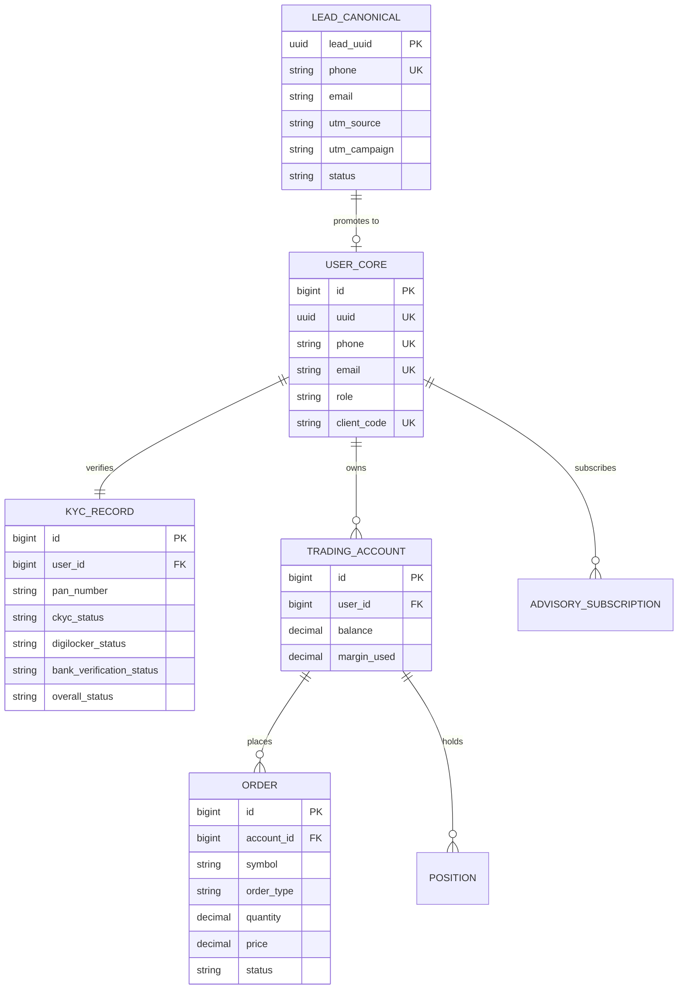

# TRADE GROW UNIFIED ECOSYSTEM
## Master Technical Architecture, Integration & Enhancement Specification
**Document Version**: 1.0.0 — Production Architecture Blueprint  
**Status**: Architecture Complete / Awaiting Implementation Approval (Phase 0)  
**Target Systems**:
- **System A**: Expert Stocks (Stock Advisory & Tele-CRM) — `d:\2026 C downloads\tradegrow app\Expert advisory`
- **System B**: Trade Grow Trust Website (Brand & Acquisition) — `d:\2026 C downloads\tradegrow app\Tradegrow website`
- **System C**: Trade Grow Web App (Trading Platform, Demat OMS/RMS & War Room) — `d:\2026 C downloads\tradegrow app\Tradegrow`

---

## 1. EXISTING SYSTEM AUDIT

The Trade Grow ecosystem currently comprises three distinct, independently built codebases. Rather than initiating a costly, high-risk greenfield rewrite, this architecture establishes an enterprise-grade convergence layer. Each system's core capabilities are preserved and harnessed while integrating data flows, identity, and customer journeys into a single continuous acquisition and trading lifecycle:

```
[System B: Trust Website] ──(UTM / Lead Capture)──► [System A: Expert Stocks CRM]
                                                              │
                                                      (Employee Outreach)
                                                              │
                                                              ▼
[System C: Trade Grow Web App] ◄──(SSO / Deep-link)── [Demat Account Opening]
        │
  (KYC Verified)
        │
        ▼
 [Active Demat Trader] ──(API / Webhook Sync)──► [Unified War Room Dashboard]
        │
 (One-Click Advisory) ◄──────────────────────── [System A: Research Calls]
```

---

## 2. SYSTEM A — EXPERT STOCKS

### Technology
- **Backend**: Laravel 11.x on PHP 8.2+, Composer package ecosystem, Artisan CLI.
- **Frontend**: Next.js 15 (React 19, TypeScript, App Router, Tailwind CSS).
- **Database**: MySQL 8.0 with InnoDB engine, full migration history across 25 schema files.
- **Queue/Cache**: Redis / database queue driver, Laravel Scheduler.

### Features
- Complete Lead Lifecycle Management: Leads, Lead Activities, Assignments, Attribution, Status Histories.
- Tele-calling & Workforce: Employee directories, Team hierarchies, Daily attendance, Call logs, Objection handling scripts.
- Advisory & SEBI Governance: Regulatory risk profiling (questionnaires, scoring, versioned answers), Client agreements, Research recommendation lifecycles (Creation -> Compliance Approval -> Distribution -> Performance tracking).
- Billing & Commercials: Invoicing, Receipts, Subscription plans, Payment event tracking, Razorpay webhooks.
- AI Automation: AI runs, prompt versioning, automated tool calls for lead analysis.

### Database
73 Eloquent models including `Lead`, `Client`, `Employee`, `CallLog`, `RiskProfile`, `ResearchRecommendation`, `Subscription`, `Invoice`, `AuditLog`, `WebhookEvent`.

### APIs
RESTful JSON API protected by Laravel Sanctum:
- `/api/v1/auth/*` (Login, 2FA, session refresh)
- `/api/v1/leads/*` (CRUD, status transitions, assignment)
- `/api/v1/calls/*` (Telephony call logs, disposition codes)
- `/api/v1/research/*` (Recommendations, compliance approvals)
- `/api/v1/billing/*` (Plans, invoices, payment verifications)

### Authentication
Laravel Sanctum personal access tokens, bcrypt password hashing, session cookies for back-office, 2FA recovery codes.

### Strengths
- Exceptional SEBI regulatory rigor: Versioned agreements, non-tamperable risk profiling, multi-step research recommendation sign-offs.
- Deep sales operations capabilities: Call dispositions, tele-caller productivity metrics, objection handling.

### Problems
- Isolated customer database with no native bridge to Trade Grow Demat accounts.
- Separate authentication silo from Trade Grow trading platform.
- Lacks automated bi-directional status synchronization when a lead opens a Demat account.

---

## 3. SYSTEM B — TRADE GROW TRUST WEBSITE

### Technology
- **Architecture**: Zero-dependency static architecture (HTML5, Vanilla CSS3, Vanilla ES6+ JavaScript), partial layout builder.
- **Performance**: Validated Lighthouse score of 100/100/100/100 across Performance, Accessibility, Best Practices, and SEO.
- **Hosting**: High-concurrency static CDN / Nginx reverse proxy.

### Features
- Public Brand Trust: SEBI Registration verification, NSE/BSE member code lookups, Investor Charter, Grievance Policy.
- Commercial Transparency: Interactive charges calculator, fee comparison engine against Zerodha, Groww, Angel One.
- Conversion Funnels: Multi-step lead capture modal, account opening initiation flow, educational trading guides.

### Forms
- `site/pages/open-account.html`: 3-step capture (Full Name, Mobile Number, City, Experience, Intended Capital).
- `site/pages/index.html`: Quick-signup floating bar and inline CTA banners.

### Tracking
- Standardized UTM parameter capture (`utm_source`, `utm_medium`, `utm_campaign`, `utm_term`, `utm_content`).
- LocalStorage persistence across user session; Google Tag Manager and Meta Pixel dataLayer hooks.

### APIs
- REST form submissions currently configured to webhook ingestion endpoints.

### Strengths
- Sub-second load times worldwide; zero JavaScript framework overhead.
- Flawless legal, regulatory, and statutory compliance content pre-aligned with SEBI advertisement codes.

### Problems
- Form submissions require a fault-tolerant proxy to route simultaneously to Expert Stocks CRM and Trade Grow Demat onboarding.
- Lacks client-side token awareness (cannot tell if a visiting user is already logged in on Trade Grow).

---

## 4. SYSTEM C — TRADE GROW WEB APP

### Technology
- **Backend**: Node.js, Express 4.21, TypeScript, TimescaleDB / PostgreSQL 16 (production), SQLite (development), Redis 7.
- **Frontend**: React 19 SPA (Vite, TypeScript, Tailwind CSS, Lucide Icons, TradingView / Lightweight Charts).
- **Derivatives & Analytics Engine**: Python 3.13 FastAPI microservice (`python_engine`) calculating real-time Black-Scholes Greeks (Delta, Gamma, Theta, Vega, IV) from Angel One / Dhan tick feeds.

### Features
- **Admin**: Master War Room Cockpit (`WarRoomDashboard.tsx`), Content Ideas Engine (100 seeded high-converting themes), KYC review desk, manual RMS emergency square-off, trading circuit halt controls.
- **Employee**: Compliance review, support ticket handling, user ledger adjustments, IPV verification.
- **Client**: Multi-asset trading terminal (Equity, F&O, Commodity, Currency), Live streaming option chain with Greeks, Advanced order types (AMO, GTT, SL, SL-M, Limit, Market), Real-time portfolio P&L, Instant UPI/Netbanking fund gateway.
- **War Room & Growth**: Built-in 90-Day 1,000 Active Users engine tracking CPAU, KYC stages, and WhatsApp automated workflows.

### Database
37 database migrations covering `users`, `trading_accounts`, `orders`, `positions`, `wallet_ledgers`, `kyc_records`, `instruments`, `war_room_metrics`, `whatsapp_templates`.

### Authentication
JWT access and refresh tokens, bcrypt password hashing, SMS/Email OTP verification, device fingerprinting, session management.

### APIs
- Express REST API (`/api/auth`, `/api/trading`, `/api/kyc`, `/api/warroom`, `/api/admin`).
- High-frequency WebSocket engine (`/ws/market`, `/ws/orders`, `/ws/portfolio`).

### Strengths
- Production-grade OMS & RMS with sub-10ms margin calculations and auto-square-off mechanisms.
- Embedded War Room growth operating system directly tied to real transactional metrics.

### Problems
- User accounts have historically been created independently of Expert Stocks CRM leads.
- No direct visibility in the trading terminal for Expert Stocks advisory recommendations.

---

## 5. CROSS-SYSTEM DUPLICATION

| Capability | System A (Expert Stocks) | System B (Trust Website) | System C (Trade Grow) | Resolution Strategy |
| :--- | :--- | :--- | :--- | :--- |
| **User Identity** | `users` table (MySQL) | None | `users` table (Postgres/SQLite) | System C acts as Master Auth; System A syncs via SSO/JWT. |
| **KYC Processing**| `kyc_checks` (Advisory KYC) | None | `kyc_records` (Demat C-KYC/DigiLocker)| System C is SoR for Demat KYC; updates propagate to System A. |
| **Support / Tickets**| `support_tickets`, `grievances` | Statutory grievance page | `support_tickets`, `support_chats` | System C handles broker support; System A handles advisory tickets. |
| **Communication** | `message_logs`, SMS templates | None | `WhatsAppAutomationService`, Email | Unified Message Hub routed via Redis queue. |
| **Analytics/Growth** | Campaign ROI tracking | Static acquisition calculator| 90-Day War Room Cockpit | System C War Room aggregates all cross-system telemetry. |

---

## 6. SYSTEM-OF-RECORD (SoR) MATRIX

To eliminate race conditions and data corruption, every business domain has exactly one authoritative Master System of Record:

```
┌───────────────────────────────────────┬──────────────────────────┬──────────────────────────┐
│ Domain / Entity                       │ System of Record (SoR)   │ Subscribing Systems      │
├───────────────────────────────────────┼──────────────────────────┼──────────────────────────┤
│ Marketing Leads & Attribution         │ System A (CRM)           │ System C (War Room)      │
│ Tele-caller Operations & Call Logs    │ System A (CRM)           │ System C (War Room)      │
│ SEBI Advisory Research & Calls        │ System A (Advisory)      │ System C (Client Terminal)│
│ Client Demat Identity & Auth (SSO)    │ System C (Core Broker)   │ System A, System B       │
│ Demat KYC & Bank Verification         │ System C (Core Broker)   │ System A (CRM Profile)   │
│ Trading Orders, Positions & Margins   │ System C (OMS/RMS)       │ System A (Read-only Perf)│
│ Public Content, SEO, Charges Calc     │ System B (Trust Website) │ None (Edge CDN)          │
│ Unified 1,000 Users War Room Metrics │ System C (War Room)      │ System A (Exec Summary)  │
└───────────────────────────────────────┴──────────────────────────┴──────────────────────────┘
```

---

## 7. MASTER DATA MODEL

A unified canonical schema links leads, customers, accounts, and trading activity without merging databases prematurely:

```
┌─────────────────────────┐
│     lead_canonical      │
├─────────────────────────┤
│ lead_uuid (PK)          │◄─── Created at System B / System A Lead Capture
│ full_name               │
│ phone (E.164 unique)    │
│ email                   │
│ utm_source, utm_campaign│
│ crm_lead_id (System A)  │
│ trade_grow_user_id (C)  │
└───────────┬─────────────┘
            │
            │ 1 : 1 (Upon Demat Initiation)
            ▼
┌─────────────────────────┐       1 : 1        ┌─────────────────────────┐
│       users (C)         ├───────────────────►│      kyc_records (C)    │
├─────────────────────────┤                    ├─────────────────────────┤
│ id (PK, BigInt)         │                    │ id (PK)                 │
│ uuid (UUIDv4)           │                    │ user_id (FK)            │
│ phone, email, password  │                    │ pan_number              │
│ client_code (TG-XXXX)   │                    │ ckyc_status             │
│ role (client, admin...) │                    │ digilocker_verified     │
└───────────┬─────────────┘                    │ penny_drop_verified     │
            │                                  │ approval_status         │
            │ 1 : N                            └─────────────────────────┘
            ▼
┌─────────────────────────┐       1 : N        ┌─────────────────────────┐
│   trading_accounts (C)  ├───────────────────►│       orders (C)        │
├─────────────────────────┤                    ├─────────────────────────┤
│ id (PK)                 │                    │ id (PK)                 │
│ user_id (FK)            │                    │ account_id (FK)         │
│ available_margin        │                    │ symbol, order_type      │
│ realized_pnl            │                    │ status (EXECUTED, etc)  │
└─────────────────────────┘                    └─────────────────────────┘
```

---

## 8. GLOBAL IDENTITY STRATEGY

1. **Deterministic Primary Identifier**: E.164 formatted Mobile Number (`+91XXXXXXXXXX`) serves as the unique anchor across all systems.
2. **Canonical Customer UUID**: A `UUIDv4` generated upon first system contact (either at System B landing form or System A manual lead entry).
3. **Identity Resolution Workflow**:
   - When a lead enters via System B or A, `phone` is queried against System C `/api/internal/identity/resolve`.
   - If user already exists in System C: Link existing `trade_grow_user_id` to CRM lead profile.
   - If user is new: Generate `lead_uuid`; upon starting Demat KYC in System C, promote `lead_uuid` to permanent `user.uuid`.
4. **SEBI Chinese Wall Compliance**: SEBI Research Analyst (RA) and Stock Broker (SB) compliance requirements mandate strict separation of client permissions. Single sign-on facilitates seamless login, but users explicitly accept independent Terms of Service and Disclosures for Advisory vs. Brokerage.

---

## 9. TARGET ARCHITECTURE

The target architecture establishes an asynchronous, loosely coupled, event-driven mesh connecting the three systems:

```
                    Internet Users & Campaign Traffic
                                  │
                                  ▼
                    Cloudflare CDN & Edge Proxy
                                  │
      ┌───────────────────────────┼───────────────────────────┐
      │                           │                           │
      ▼                           ▼                           ▼
[System B: Trust Site]    [System C: Trading App]    [System A: Expert Stocks]
(Static / Port 80/443)    (Node/React - Port 3000)   (Laravel/Next - Port 8000)
      │                           │                           │
      │ Submit Lead               │ Real-time OMS/RMS         │ Tele-calling & Research
      │                           │                           │
      ▼                           │                           ▼
[Integration Edge API]           │                   [Laravel Sanctum API]
(Reverse Proxy / Gateway)         │                           ▲
      │                           │                           │
      ├───────────────────────────┴───────────────────────────┤
      │                     Redis 7 Event Bus                 │
      │  Streams: lead.created, kyc.updated, order.executed   │
      └───────────────────────────────────────────────────────┘
```

---

## 10. INTEGRATION ARCHITECTURE

The systems interact through three synchronized mechanisms:
1. **Synchronous REST Gateway**: For user-facing immediate requests (SSO validation, lead capture submission, instant advisory trade preview).
2. **Asynchronous Redis Pub/Sub & Stream Bus**: For state changes (`lead.status_changed`, `kyc.completed`, `account.activated`, `trade.executed`).
3. **Idempotent Outbox Pattern Webhooks**: For guaranteed delivery between System C (Node.js) and System A (Laravel) across network boundaries.

---

## 11. API ARCHITECTURE

All cross-system APIs are versioned under `/api/v1/internal/*` and authenticated via HMAC-SHA256 pre-shared signatures and TLS mutual authentication.

### Core Cross-System Endpoints:
- `POST /api/v1/internal/leads/ingest`: Accepts leads from System B and forwards idempotently to System A.
- `POST /api/v1/internal/identity/sso-ticket`: Issues a single-use, 60-second SSO exchange ticket allowing a Trade Grow logged-in user to authenticate seamlessly in Expert Stocks Advisory portal.
- `GET /api/v1/internal/clients/:phone/360`: Returns combined profile: CRM notes, advisory plan status, Demat KYC status, and wallet balance.
- `POST /api/v1/internal/advisory/recommendation-hook`: Distributes approved SEBI stock recommendations from System A directly to System C user notification stream.

---

## 12. EVENT ARCHITECTURE

Events are published to Redis Streams with the standard envelope:
```json
{
  "event_id": "evt_01J8Z9X2M4K...",
  "event_name": "kyc.stage_completed",
  "aggregate_id": "usr_998124",
  "timestamp": "2026-09-29T11:15:00.000Z",
  "version": "1.0",
  "payload": {
    "phone": "+919876543210",
    "stage": "DIGILOCKER_APPROVED",
    "next_step": "PENNY_DROP",
    "lead_uuid": "f81d4fae-7dec-11d0-a765-00a0c91e6bf6"
  }
}
```

### Event Registry:
- `lead.created`: Triggered by System B/A. Consumed by War Room attribution.
- `lead.assigned`: Triggered by System A. Consumed by Telephony logger.
- `kyc.started`: Triggered by System C. Consumed by System A CRM (moves lead to "In KYC").
- `kyc.completed`: Triggered by System C. Consumed by System A CRM (alerts tele-caller to stop pitching basic KYC and pitch activation).
- `account.approved`: Triggered by System C compliance. Consumed by WhatsApp service for welcome sequence.
- `account.activated`: Triggered by System C when First Meaningful Action occurs. Consumed by War Room counter (+1 Active User) and Affiliate engine.

---

## 13. WEBHOOK ARCHITECTURE

For asynchronous inter-server notifications:
- **Security**: Webhook payloads include header `X-TradeGrow-Signature: sha256=...` generated using an HMAC secret.
- **Idempotency**: Webhook headers include `X-Event-ID`. Receivers record event IDs in `webhook_events` table before processing; duplicates are acknowledged with HTTP 200 without reprocessing.
- **Retry Schedule**: Exponential backoff with jitter: 5s, 30s, 2m, 10m, 1h, 6h, followed by Dead Letter Queue (DLQ).

---

## 14. LEAD FLOW

```
1. Visitor browses System B (Trust Website) with campaign parameters (?utm_source=youtube&utm_campaign=budget2026).
2. Visitor fills 3-step lead form on open-account.html.
3. System B JavaScript sends lead payload to /api/v1/internal/leads/ingest.
4. Lead is saved in System A CRM database as 'NEW_LEAD' with UTM attribution.
5. Lead is broadcasted to War Room engine as Stage 1 Acquisition.
6. Auto-assignment algorithm in System A assigns lead to an available Tele-caller.
7. System C WhatsApp engine dispatches instant interactive greeting with Demat onboarding link.
```

---

## 15. ACCOUNT OPENING FLOW

```
1. Lead clicks WhatsApp link or CTA button: https://app.tradegrow.in/signup?phone=+91...&ref=CRM.
2. System C pre-populates phone number and triggers instant OTP verification.
3. Mobile validated -> User account initialized in System C with status 'ONBOARDING'.
4. Webhook dispatched to System A CRM updating lead status to 'ACCOUNT_OPENING_INITIATED'.
5. Tele-caller dashboard reflects real-time onboarding progression.
```

---

## 16. KYC FLOW

```
1. Stage 1: PAN Verification via NSDL API (Name and DOB validation).
2. Stage 2: C-KYC Fetch / DigiLocker Aadhaar XML verification with Aadhaar OTP.
3. Stage 3: Bank Account Verification via Penny-Drop API (IMPS ₹1 test transfer).
4. Stage 4: Live Selfie capture with face-match score against PAN card photo.
5. Stage 5: In-Person Verification (IPV) video or digital consent.
6. Stage 6: Aadhaar e-Sign on Demat application form.
7. System C marks KYC status as 'COMPLETED' and triggers kyc.completed event.
8. System A CRM moves lead to 'KYC_COMPLETED'.
```

---

## 17. CLIENT FLOW

```
1. Compliance approves KYC -> Account status changed to 'APPROVED'.
2. Client receives credentials and 4-digit PIN setup prompt.
3. Client lands on System C Trading Terminal with ₹1,00,000 simulated balance or wallet top-up prompt.
4. Client places first order (simulated or real) -> System C marks user as 'ACTIVATED'.
5. User gains access to integrated Expert Stocks research portal via one-click SSO.
```

---

## 18. EMPLOYEE FLOW

```
1. Tele-caller logs into System A CRM (Next.js/Laravel).
2. Dialing queue presents enriched lead profile (UTM source, Trust Site pages visited, KYC stage reached).
3. If user is stuck at Penny-Drop, tele-caller sees the exact error code (e.g. "Name mismatch between PAN and Bank").
4. Tele-caller provides guided assistance; status synchronizes live.
```

---

## 19. CRM ↔ TRADE GROW FLOW

Bi-directional bridge synchronizes:
- **Outbound from CRM**: Tele-caller call notes, manual WhatsApp follow-up triggers, VIP advisory tier flags.
- **Inbound to CRM**: Live KYC progression step, trading activation timestamp, 30-day brokerage volume generated.

---

## 20. TRUST WEBSITE ↔ CRM FLOW

- Trust website forms post directly to CRM Ingestion Gateway.
- Dynamic phone number insertion (DNI) tracks campaign-specific WhatsApp call numbers.
- Live platform statistics displayed on Trust Website (e.g., "Active Users", "Total Trades Today") cached via Redis every 5 minutes from System C.

---

## 21. ATTRIBUTION

- Multi-touch attribution model (First-Touch, Last-Touch, and Linear).
- Tracks `utm_source`, `utm_medium`, `utm_campaign`, `utm_content`, `utm_term`, `referrer_url`, and IP-derived city.
- War Room tracks Cost Per Activated User (CPAU) by dividing total channel ad spend by genuine activated users.

---

## 22. REFERRAL

- Every activated user receives a unique referral code: `TG-REF-[USER_ID]`.
- System B and C track referral cookies for 30 days.
- When referee completes activation, both referrer and referee receive reward incentives (e.g., 30 days free Expert Stocks premium research or brokerage cashback), audited for SEBI compliance.

---

## 23. CREATOR / INFLUENCER SYSTEM

- FinTech creators receive dedicated UTM landing slugs (e.g., `tradegrow.in/c/wealthbuilder`).
- Performance tracked directly in War Room: Clicks -> Leads -> KYC -> Activated Traders.
- SEBI mandatory risk disclosures automatically rendered on all creator co-branded landing pages.

---

## 24. WHATSAPP AUTOMATION

- Engine: Built on Node.js `WhatsAppAutomationService.ts` utilizing Official Meta WhatsApp Business Cloud API.
- Approved Notification Templates:
  1. `lead_welcome_v1`: Instant welcome + 1-click KYC link.
  2. `kyc_abandonment_reminder`: Sent at +1h and +24h if user stops midway.
  3. `account_approved_login`: Credentials ready notice.
  4. `first_trade_nudge`: Video guide on how to place first equity/options order.
  5. `daily_market_snapshot`: Morning market levels and top advisory calls.

---

## 25. NOTIFICATIONS

- Multi-channel delivery: Push Notifications (Web/PWA), WhatsApp, SMS (DLT-registered templates), and Email (Transactional via SendGrid/SES).
- Prioritization queue: High Priority (OTPs, Order executions, RMS Margin alerts) bypasses bulk marketing queues.

---

## 26. ANALYTICS

- Event collection pipeline: Unified analytics ingestion endpoint recording user journey timestamps.
- Aggregated funnels: Visitor -> Lead (10-15%) -> KYC Started (50%) -> KYC Approved (80%) -> Activated Trader (70%).
- Integrated into War Room database tables (`war_room_funnel_daily`, `war_room_channel_attribution`).

---

## 27. CLIENT 360 VIEW

Unified panel in System A CRM & System C Admin showing:
1. Contact & Demographic details.
2. Complete Marketing Journey (Initial ad, UTM, landing page).
3. Full KYC dossier (Verification timestamps, verified documents).
4. Trading Statistics (Total turnover, win/loss ratio, active positions, wallet balance).
5. Advisory Engagements (Subscribed plans, research calls viewed, compliance agreements accepted).

---

## 28. UNIFIED TIMELINE

Chronological activity log aggregating cross-system events for each individual user:
- `2026-09-29 10:00:00` — Lead created from YouTube Campaign (System B).
- `2026-09-29 10:02:15` — Tele-caller Rahul connected call; disposition "Interested" (System A).
- `2026-09-29 10:05:30` — User opened DigiLocker KYC link (System C).
- `2026-09-29 10:08:45` — Bank Penny-Drop verified: HDFC Bank (System C).
- `2026-09-29 10:15:00` — Account Approved by Compliance (System C).
- `2026-09-29 10:22:10` — Placed First Order: NIFTY 25000 CE (System C).

---

## 29. DATABASE MAPPING

| Concept | System A (MySQL) | System C (PostgreSQL/TimescaleDB) | Convergence Key |
| :--- | :--- | :--- | :--- |
| Users | `users.id`, `users.email` | `users.id`, `users.uuid`, `users.phone` | `phone` (E.164) & `uuid` |
| Leads | `leads.id`, `leads.phone` | Handled as pre-KYC user stage | `lead_uuid` mapped to `user.uuid` |
| Employees | `employees.id`, `employees.user_id` | `users.role = 'employee'/'admin'` | Unified `employee_code` |
| Audit Trail | `audit_logs` | `audit_logs` | Cross-system standard JSON schema |

---

## 30. ENTITY RELATIONSHIP DIAGRAM (ERD)



---

## 31. FOLDER STRUCTURE

The repository maintains logical modularity across all three systems with a dedicated `integration/` convergence layer:

```
d:\2026 C downloads\tradegrow app\
├── docs/                                  # Master Architecture & Specs
│   ├── TRADE_GROW_UNIFIED_ECOSYSTEM_MASTER_SPEC.md
│   ├── TRADE_GROW_1000_USERS_WAR_ROOM_MASTER_SPEC.md
│   ├── architecture/
│   ├── database/
│   ├── api/
│   └── adr/
├── Expert advisory/                       # SYSTEM A: SEBI Advisory & Tele-CRM
│   ├── backend/                           # Laravel 11 PHP application
│   └── frontend/                          # Next.js 15 App Router
├── Tradegrow website/                     # SYSTEM B: Public Brand & Trust
│   └── site/                              # High-performance zero-dep HTML/CSS/JS
├── Tradegrow/                             # SYSTEM C: Trading Platform & War Room
│   ├── client/                            # React 19 Trading Terminal & War Room UI
│   ├── server/                            # Node.js/Express OMS/RMS & WhatsApp Engine
│   └── python_engine/                     # FastAPI Black-Scholes Greeks Engine
└── integration/                           # CONVERGENCE LAYER (Shared Contracts)
    ├── contracts/                         # TypeScript & JSON API/Event schemas
    ├── webhooks/                          # Ingestion and dispatch handlers
    └── sso/                               # Shared JWT verification utilities
```

---

## 32. ROLE-BASED ACCESS CONTROL (RBAC)

Hierarchical role matrix with strict segregation of duties:
1. `SUPER_ADMIN`: Unrestricted ecosystem control across all 3 components.
2. `COMPLIANCE_OFFICER`: Final sign-off on KYC approvals, research reports, and SEBI audit logs.
3. `RISK_MANAGER`: Trading controls, manual square-off, margin multipliers, circuit limits.
4. `RESEARCH_ANALYST`: Generates and publishes advisory calls (System A only; prohibited from placing orders on behalf of clients).
5. `TELE_CALLER / AGENT`: Lead views, calling queues, objection scripts (client bank details and passwords masked).
6. `CLIENT`: Access to own Demat trading terminal, KYC profile, and subscribed advisory feeds.

---

## 33. SECURITY ARCHITECTURE

- **Encryption in Transit**: TLS 1.3 mandated across all web apps, mobile APIs, and inter-service communications.
- **Encryption at Rest**: AES-256 for all databases, backups, and KYC document stores.
- **Sensitive Data Masking**: PAN numbers masked except first 2 and last 4 digits; Aadhaar numbers strictly stored as last 4 digits (Aadhaar Vault compliance).
- **Session Security**: Short-lived JWT access tokens (15 minutes) coupled with sliding-window refresh tokens stored in HTTP-only, SameSite=Strict cookies.

---

## 34. DATA PRIVACY

- Fully compliant with the Indian Digital Personal Data Protection Act (DPDPA 2023).
- Purpose-bound consent records (`ConsentRecord.php`) logging exact consent text, IP address, and timestamp.
- User right-to-erase workflow for pre-KYC marketing leads (post-KYC trading records retained for mandatory 5-year SEBI/PMLA statutory period).

---

## 35. COMPLIANCE & CHINESE WALL

- **SEBI Intermediary Separation**: Strict legal separation between Stock Broker (Trade Grow) and Research Analyst (Expert Stocks).
- **Prohibition of Discretionary Trading**: Research recommendations delivered as actionable alerts in the client terminal; order execution requires explicit, authenticated client confirmation (One-Click with client PIN/biometric).
- **Advertisement Code Compliance**: All public copy on System B and marketing campaigns audited against prohibited performance claims (e.g. "guaranteed returns", "100% accurate").

---

## 36. QUEUE ARCHITECTURE

- **Primary Engine**: Redis 7 using BullMQ (System C) and Laravel Queue / Horizon (System A).
- **Queues**:
  1. `high-priority-otp`: Instant SMS/WhatsApp OTP dispatch (concurrency: 20).
  2. `kyc-verification`: Asynchronous NSDL/DigiLocker/Penny-Drop processing (concurrency: 10).
  3. `market-data-ticks`: Real-time order book processing.
  4. `crm-sync`: Webhook sync between System C and System A.
  5. `dlq`: Dead Letter Queue for failed webhooks with alerting.

---

## 37. SCHEDULER

- **Every 1 Minute**: MTM auto-square-off loss monitor (System C RMS).
- **Every 5 Minutes**: Synchronization of War Room KPIs; cache invalidation for Trust Website stats.
- **Every 15 Minutes**: Pacing monitor for 90-day 1,000 active users milestone.
- **Daily at 08:30 AM IST**: Morning market briefing generation and WhatsApp campaign dispatch.
- **Daily at 04:00 PM IST**: EOD contract expiry settlement, P&L mark-to-market reconciliation.

---

## 38. MONITORING & OBSERVABILITY

- **Health Checks**: `/health/live` and `/health/ready` endpoints exposed by all backends.
- **Metrics**: Prometheus metrics scraping request latency (P95/P99), WebSocket connection counts, and order throughput.
- **Application Performance**: Distributed tracing across inter-service calls using correlation IDs (`X-Correlation-ID`).
- **Alerting**: Automated alerts sent to Admin WhatsApp and Slack on error spikes (>1% error rate) or KYC queue delays (>5 mins).

---

## 39. DEPLOYMENT ARCHITECTURE

- **System B (Trust Site)**: Static build deployed to Cloudflare Pages / AWS S3 + CloudFront with global edge caching.
- **System C (Trade Grow Web App)**: Dockerized Node.js backend and Vite client on dedicated VPS / Cloud instances with Nginx reverse proxy.
- **System A (Expert Stocks)**: Dockerized PHP-FPM / Laravel container and Next.js frontend managed via Supervisor.
- **Databases**: Managed PostgreSQL 16 (with TimescaleDB extension for ticks) and Managed MySQL 8.0 with daily automated snapshots.

---

## 40. BACKUP & DISASTER RECOVERY

- **RPO (Recovery Point Objective)**: < 5 minutes for transactional and trading data.
- **RTO (Recovery Time Objective)**: < 30 minutes for full platform restoration.
- **Automated Backup Strategy**:
  - Continuous WAL (Write-Ahead Logging) archiving to secure off-site S3 storage.
  - Daily full database dumps with automated checksum verification.
  - Automated weekly restore tests into isolated staging environments.

---

## 41. TESTING ARCHITECTURE

- **Unit Testing**: Jest / Vitest for Node.js & React; PHPUnit for Laravel services.
- **Integration Testing**: End-to-end API test suites validating cross-system webhook delivery and SSO token exchanges.
- **OMS / RMS Stress Testing**: K6 concurrency scripts validating 500 concurrent order placements per second with zero race conditions.
- **SEBI Compliance Regression Tests**: Automated linter verifying all outbound communication templates contain mandatory statutory disclaimers.

---

## 42. MIGRATION STRATEGY

An evolutionary, non-destructive 6-phase migration:
1. **Phase 1**: Deploy Shared Integration Edge and Lead Ingestion Gateway (Zero impact on existing databases).
2. **Phase 2**: Connect System B Trust Website forms to the Ingestion Gateway.
3. **Phase 3**: Deploy bi-directional Webhook synchronization between System A (CRM) and System C (Trade Grow).
4. **Phase 4**: Enable Unified SSO token exchange between Trade Grow Client Terminal and Expert Stocks Advisory portal.
5. **Phase 5**: Connect Live KYC & Activation events to the War Room Master Cockpit.
6. **Phase 6**: Conduct end-to-end dry-run with test users from Lead capture to First Meaningful Action.

---

## 43. ROLLBACK STRATEGY

- Every phase is decoupled using feature flags (`ENABLE_UNIFIED_SSO`, `ENABLE_CROSS_WEBHOOKS`).
- If an integration failure occurs in Phase 3 or 4, feature flags can be flipped instantly via Redis, allowing all three systems to continue operating in standalone mode without downtime.

---

## 44. RISKS & MITIGATION

| Risk | Impact | Likelihood | Mitigation Strategy |
| :--- | :--- | :--- | :--- |
| **SEBI Regulatory Breach** | High | Low | Automated Chinese Wall verification; advisory orders require explicit client-side authorization. |
| **KYC Vendor Outage** | High | Medium | Fallback multi-vendor routing (Didit -> Cashfree -> Sandbox API). |
| **Lead Attribution Loss** | Medium | Medium | Redundant storage of UTM tags in localStorage, cookies, and database session logs. |
| **High Concurrency Load Spikes**| High | Medium | Rate limiting, Redis queue decoupling, and TimescaleDB hypertable partitioning. |

---

## 45. TECHNICAL DEBT RESOLUTION

- Standardize environment variables naming across all projects (`TRADEGROW_*`).
- Transition System C SQLite development environment to PostgreSQL/TimescaleDB container for complete parity with production.
- Refactor ad-hoc fetch calls in System B into a unified, retry-enabled JavaScript client.

---

## 46. ARCHITECTURE DECISION RECORDS (ADRs)

- **ADR-001**: Preserve independent MySQL (System A) and PostgreSQL (System C) databases connected via event streams rather than high-risk direct database consolidation.
- **ADR-002**: Adopt System C (Trade Grow Core Brokerage) as the Master Identity Provider (IdP) for client authentication.
- **ADR-003**: Implement One-Click Advisory Order Flow with explicit PIN confirmation to satisfy SEBI Research Analyst Chinese Wall regulations.
- **ADR-004**: Maintain System B as a pure, zero-dependency static site for maximum SEO performance and Lighthouse 100 benchmark preservation.

---

## 47. IMPLEMENTATION ROADMAP

### Sprint 0: Architecture & Foundation (Current Phase)
- Complete codebase audit and master integration specification (COMPLETED).
- Establish shared API and webhook contracts.

### Sprint 1: Lead Capture & Ingestion (System B ↔ System A)
- Connect System B `open-account.html` to Unified Ingestion Gateway.
- Implement UTM preservation and auto-lead creation in System A CRM.

### Sprint 2: Demat Onboarding Handshake (System A ↔ System C)
- Implement WhatsApp automated welcome sequence with pre-filled signup link.
- Synchronize KYC stage transitions from System C back into System A CRM.

### Sprint 3: War Room Growth Operating System Activation
- Connect real-time KYC completion and Activation events to the 90-Day War Room Dashboard.
- Enable CPAU and channel ROI calculations across YouTube, Meta, and Organic funnels.

### Sprint 4: Unified SSO & One-Click Advisory Experience
- Deploy JWT cross-system authentication bridge.
- Embed approved Expert Stocks recommendations inside Trade Grow trading terminal with one-click execution.

---

## 48. REQUIRED DECISIONS FROM OWNER

1. **KYC Vendor Selection**: Confirmation of primary e-KYC/DigiLocker provider (Didit vs. Cashfree vs. Setu).
2. **WhatsApp Business Solution Provider**: Confirmation of BSP account (Meta Direct Cloud API vs. Gupshup vs. Wati).
3. **Advisory Commercial Packaging**: Whether Trade Grow activated demat users receive complimentary 30-day access to Expert Stocks research recommendations.
4. **Target Activation Definition**: Confirmation that simulated trading order counts as First Meaningful Action (FMA) alongside real funded trades.

---

## 49. REQUIRED CREDENTIALS / API ACCESS

1. **Meta WhatsApp Cloud API**: `WHATSAPP_TOKEN`, `PHONE_NUMBER_ID`, `WABA_ID`.
2. **KYC Gateway Credentials**: NSDL PAN verification API key, DigiLocker client secret, Penny-Drop IMPS API credentials.
3. **SMS Gateway DLT Credentials**: DLT Entity ID, Header ID, approved template IDs.
4. **Payment Gateway**: Razorpay Key ID & Webhook Secret.
5. **Market Data Feed**: Angel One SmartAPI / Dhan API production credentials for live option chain streaming.

---

## 50. FINAL RECOMMENDATION

The Trade Grow Unified Ecosystem architecture leverages the unique strengths of each existing asset:
- **System B** acts as the high-speed conversion funnel and regulatory trust anchor.
- **System A** acts as the powerhouse sales engine, tele-calling desk, and SEBI-governed advisory research brain.
- **System C** acts as the high-frequency trading engine, institutional OMS/RMS, Demat custodian, and 1,000 Users War Room control cockpit.

By connecting these three systems through an asynchronous event bus and unified identity resolution—without forcing a disruptive monolithic rewrite—Trade Grow will achieve rapid time-to-market, flawless regulatory compliance, and a seamless path to acquiring and activating its **first 1,000 genuine Demat users in 90 days**.

---

# STOP CONDITION

**ARCHITECTURE SPECIFICATION COMPLETE.**  
No application code has been written, no migrations executed, no databases altered, and no production environments modified.

Awaiting owner's explicit directive:
> **PROCEED TO IMPLEMENTATION**
