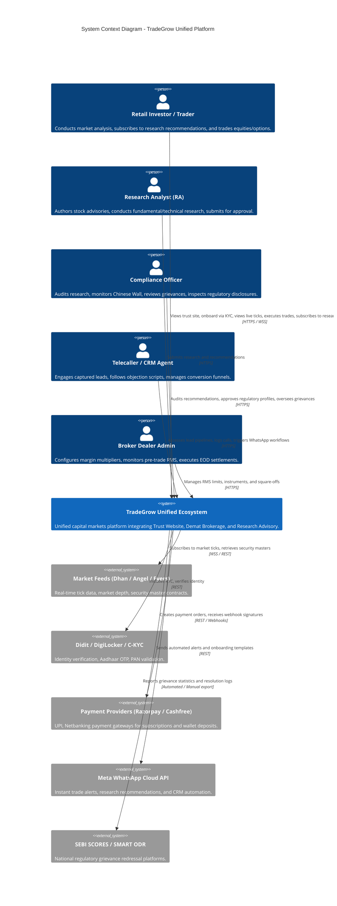
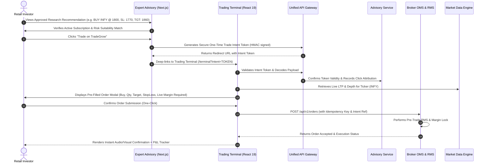

# TradeGrow Unified Platform — Technical Architecture Specification

**Document Reference**: `docs/architecture/01_UNIFIED_SYSTEM_ARCHITECTURE.md`  
**Status**: APPROVED BASELINE (Phase 0)  
**Author**: Lead FinTech Systems Architect  

---

## 1. Vision & Architectural Principles

The TradeGrow Unified Platform combines **Trust & Client Acquisition**, **Institutional-Grade Demat Trading**, and **SEBI-Regulated Stock Advisory** into a unified Indian capital markets ecosystem.

```
                  ┌─────────────────────────────────────────────────────────┐
                  │                 USER ACCESS CHANNELS                    │
                  │  Organic Visitors • Retail Traders • Advisory Clients   │
                  └────────────────────────────┬────────────────────────────┘
                                               │
               ┌───────────────────────────────┼───────────────────────────────┐
               ▼                               ▼                               ▼
    ┌─────────────────────┐         ┌─────────────────────┐         ┌─────────────────────┐
    │  Tradegrow website  │         │   Trading Terminal  │         │   Expert Advisory   │
    │  Trust & Education  │         │  (React 19 / Vite)  │         │ (Next.js 15 Portal) │
    │  • Zero-Dep SSG     │         │  • Live Quotes & TV │         │ • SEBI Research     │
    │  • Claim Linters    │         │  • Option Chain+IV  │         │ • Risk Profiler     │
    │  • Lead Funnels     │         │  • 1-Click Buy/Sell │         │ • Subscriptions     │
    └──────────┬──────────┘         └──────────┬──────────┘         └──────────┬──────────┘
               │                               │                               │
               └───────────────────────────────┼───────────────────────────────┘
                                               │ HTTPS / WSS
                                               ▼
    ┌─────────────────────────────────────────────────────────────────────────────────────┐
    │                     UNIFIED API GATEWAY & IDENTITY PROVIDER (IdP)                   │
    │  • JWT + Argon2id / OAuth2 Federation       • Rate Limiting & DDOS Shield (Helmet)  │
    │  • Single Sign-On (SSO) across Subdomains   • Unified KYC Session Token Hand-off    │
    └──────────────────────┬───────────────────┬───────────────────┬──────────────────────┘
                           │                   │                   │
         ┌─────────────────┘                   │                   └─────────────────┐
         ▼                                     ▼                                     ▼
┌──────────────────┐                 ┌──────────────────┐                  ┌──────────────────┐
│  BROKER SERVICE  │                 │  ADVISORY & CRM  │                  │  QUANT OPTIONS   │
│  (Node.js 22/TS) │                 │  (Domain Engine) │                  │  (Python FastAPI)│
│  • OMS & RMS     │                 │  • Research Desk │                  │  • py_vollib     │
│  • Wallet Ledger │                 │  • Dual Approval │                  │  • Black-Scholes │
│  • Dhan Adapter  │                 │  • CRM Pipelines │                  │  • Greeks & IV   │
│  • Market WS Hub │                 │  • Telephony     │                  │  • Payoff Curves │
└────────┬─────────┘                 └────────┬─────────┘                  └────────┬─────────┘
         │                                    │                                     │
         └─────────────────┬──────────────────┴──────────────────┬──────────────────┘
                           ▼                                     ▼
        ┌────────────────────────────────────┐ ┌────────────────────────────────────┐
        │       REDIS 7 DATA CLUSTER         │ │       POSTGRESQL 16 / TIMESCALE    │
        │ • Tick Cache & Pub/Sub             │ │ • Hypertables (Ticks, Trades, Logs)│
        │ • Idempotency & Distributed Locks  │ │ • ACID Double-Entry Wallets & Books│
        │ • Session States & Queues          │ │ • 73+ Relational Domain Tables     │
        └────────────────────────────────────┘ └────────────────────────────────────┘
```

### Core Design Principles
1. **Separation of Concerns with Deep Workflow Integration**:
   - The trading broker OMS and execution engine must execute with sub-second deterministic latency.
   - The advisory desk operates under strict SEBI (Research Analysts) Regulations 2014, maintaining an auditable Chinese Wall while enabling 1-click execution for authorized clients.
2. **Deterministic Financial Ledger (Double-Entry Bookkeeping)**:
   - Floating point arithmetic is prohibited for currency calculations.
   - All margin allocations, brokerages, deposits, withdrawals, and trade settlements are recorded via atomic, immutable ledger pairs (`wallet_ledger`).
3. **Defense-in-Depth & Zero-Trust Security**:
   - Mandatory TOTP/2FA for administrative and research publishing actions.
   - Pre-trade risk validation enforced at the engine layer, irrespective of frontend inputs.
4. **Resilient Real-time Streaming**:
   - Exchange websocket connections maintain automatic heartbeat monitoring and automated TOTP regeneration.
   - Client WebSockets incorporate backpressure sheds to protect browser threads from saturation.

---

## 2. C4 Model Specification

### 2.1 System Context (Level 1)



---

## 3. Subsystem Architecture

### 3.1 Subsystem 1: TradeGrow Trust & Education Website
* **Runtime**: High-performance static distribution (`build/build.js`).
* **Role**: First point of contact. High-speed, accessibility-first (WCAG AA compliant) marketing presence.
* **Key Components**:
  - `site/config/site.config.json`: Master regulatory registration metadata, officer details, and grievance escalation matrix.
  - `charges.config.json`: Transparent fee breakdown isolating statutory government levies from TradeGrow charges.
  - `build.js` Claim Linter: Static validation barring illicit marketing terminology (`"guaranteed returns"`, `"multibagger"`, `"zero tax"`).
  - High-intent acquisition forms with UTM parameter preservation.

### 3.2 Subsystem 2: Demat Trading Brokerage Engine
* **Runtime**: Node.js 22 + TypeScript with Express 4.21 and `ws` 8.18.
* **Role**: High-throughput execution gateway and real-time market data distribution.
* **Key Components**:
  - `MarketDataEngine`: Multiplexes live tick streams across Dhan v2, Angel One, and Fyers adapters.
  - `OMS` (Order Management System): Manages full lifecycle states (`PENDING`, `ACCEPTED`, `EXECUTING`, `FILLED`, `CANCELLED`, `REJECTED`).
  - `RMS` (Risk Management System): Pre-trade validation enforcing margin requirements, contract expiry constraints, instrument limits, and automated loss square-offs.
  - `VirtualWalletLedger`: Atomic double-entry financial ledger guaranteeing transaction consistency.
  - `Python Options Greeks Service`: Dedicated FastAPI daemon executing Black-Scholes models for Implied Volatility and Delta/Gamma/Theta/Vega calculations.

### 3.3 Subsystem 3: Expert Advisory & CRM Desk
* **Runtime**: Domain Services with Next.js 15 Client Portal and Filament 3 Back-office.
* **Role**: Regulated research distribution, client suitability, subscription billing, and sales operations.
* **Key Components**:
  - `ResearchDesk`: Multi-stage recommendation authoring and approval engine enforcing SEBI Chinese Wall guidelines.
  - `SuitabilityEngine`: Automated risk profiling questionnaires assessing investor risk tolerance before research distribution.
  - `BillingEngine`: Automated GST-compliant invoicing, subscription recurring billing, and payment reconciliation.
  - `UnifiedCRM`: Multi-channel lead attribution, automated agent assignment, objection scripting, and communication event logging.

---

## 4. Cross-System Workflow: 1-Click Advisory Order Execution

One of the platform's core strategic advantages is converting research insights into trading action:



---

## 5. Latency & Performance Budgets

| Operation | Target Budget (p95) | Critical Path Components |
| :--- | :--- | :--- |
| **Market Data Tick Fanout** | `< 25ms` | Dhan WS -> Redis Pub/Sub -> WS Broadcaster -> Browser RAF |
| **Pre-Trade RMS Validation** | `< 12ms` | Redis Balance Lock -> RMS Rules -> Margin Verification |
| **Order Placement to Fill** | `< 150ms` | OMS Acceptance -> Execution Matching -> Ledger Settlement |
| **Advisory Recommendation Broadcast** | `< 500ms` | Approval Gate -> Redis Pub/Sub -> WhatsApp API & Client WebSockets |
| **Public Trust Website First Contentful Paint** | `< 400ms` | CDN Edge Cache -> Static HTML (Zero JS execution required) |
| **Options Greeks Calculation (Batch of 50)** | `< 45ms` | Python `py_vollib` vectorized C-extensions -> Redis Cache |

---
*Technical architecture certified and saved to [01_UNIFIED_SYSTEM_ARCHITECTURE.md](file:///d:/2026%20C%20downloads/tradegrow%20app/docs/architecture/01_UNIFIED_SYSTEM_ARCHITECTURE.md).*
