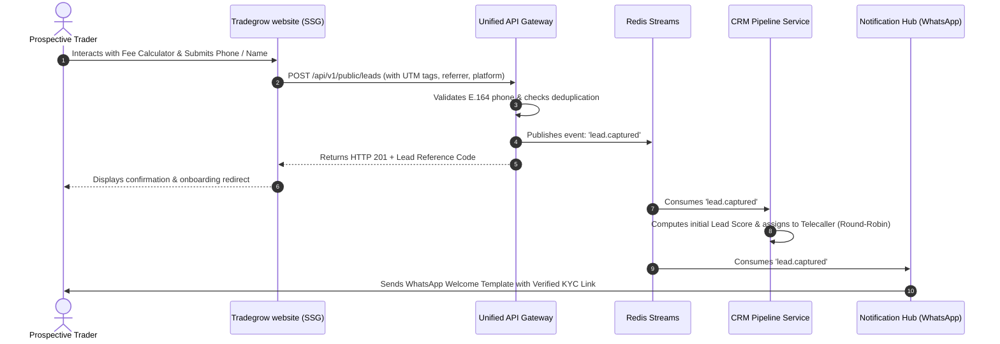
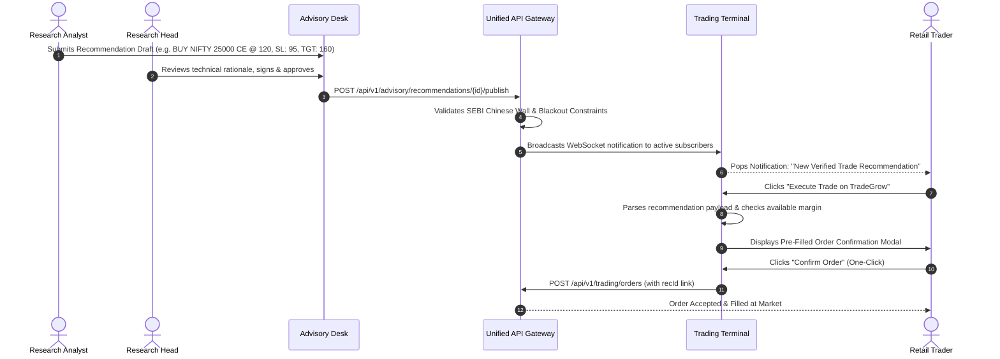

# TradeGrow Unified Platform — Integration Architecture Specification

**Document Reference**: `docs/architecture/02_INTEGRATION_ARCHITECTURE.md`  
**Status**: APPROVED BASELINE (Phase 0)  

---

## 1. Cross-Domain Integration Overview

The TradeGrow ecosystem unites three decoupled application layers into an end-to-end customer journey:

```
┌─────────────────────┐         ┌─────────────────────┐         ┌─────────────────────┐
│  Tradegrow website  │         │   Trading Terminal  │         │   Expert Advisory   │
│ (Trust/Acquisition) │         │  (Demat Execution)  │         │   (Research Desk)   │
└──────────┬──────────┘         └──────────┬──────────┘         └──────────┬──────────┘
           │                               │                               │
           │ 1. Lead Capture               │ 3. 1-Click Advisory Order     │ 2. Research Pub
           │    & Attribution              │    Execution & Fill           │    & Suitability
           ▼                               ▼                               ▼
┌─────────────────────────────────────────────────────────────────────────────────────┐
│                            UNIFIED EVENT BUS (Redis Streams)                        │
│   Topics: lead.captured • kyc.verified • rec.published • order.filled • pnl.settled  │
└──────────────────────────────────────────┬──────────────────────────────────────────┘
                                           │
         ┌─────────────────────────────────┴─────────────────────────────────┐
         ▼                                                                   ▼
┌──────────────────────────────────┐               ┌──────────────────────────────────┐
│       CRM & TELEPHONY ENGINE     │               │   MULTI-CHANNEL NOTIFICATION HUB │
│ • Auto-assign leads to agents    │               │ • Meta WhatsApp Cloud API        │
│ • Objection scripting prompt     │               │ • High-priority SMTP alerts      │
│ • Conversion funnel analytics    │               │ • In-App WebSocket notifications │
└──────────────────────────────────┘               └──────────────────────────────────┘
```

---

## 2. Core Integration Workflows

### 2.1 Workflow 1: Trust Website to Demat Onboarding & CRM Pipeline



### 2.2 Workflow 2: Advisory Recommendation to Terminal 1-Click Execution



---

## 3. Event Bus Specification (Redis Streams)

All asynchronous cross-service communications leverage **Redis Streams** with consumer groups for guaranteed at-least-once delivery:

| Stream Key | Event Type | Producer | Consumers |
| :--- | :--- | :--- | :--- |
| `stream:leads` | `lead.captured` | Public API Gateway | CRM Service, WhatsApp Dispatcher |
| `stream:kyc` | `kyc.verified` | Didit KYC Webhook | User Account Provisioner, CRM Service |
| `stream:advisory` | `rec.published` | Advisory Service | Terminal Broadcaster, WhatsApp Service |
| `stream:trading` | `order.filled` | OMS Execution Engine | Portfolio Service, Ledger, Trade Alerts |
| `stream:rms` | `margin.breached` | RMS Loss Monitor | Auto-Square-Off Engine, Push Notifications |
| `stream:billing` | `sub.activated` | Payment Gateway | Advisory Access Controller, Invoicing |

---

## 4. Multi-Channel Notification Hub Architecture

The unified notification hub abstracts downstream providers behind a unified messaging interface:
* **WhatsApp Cloud API (Meta)**: Used for high-priority transaction confirmations, advisory alerts, and CRM onboarding messages.
* **Hostinger / Dedicated SMTP**: Used for contract notes, tax invoices, password resets, and compliance grievance updates.
* **In-App WebSockets**: Low-latency (`<20ms`) trading fills, order status changes, and live market price alerts.

---
*Integration architecture certified and saved to [02_INTEGRATION_ARCHITECTURE.md](file:///d:/2026%20C%20downloads/tradegrow%20app/docs/architecture/02_INTEGRATION_ARCHITECTURE.md).*
