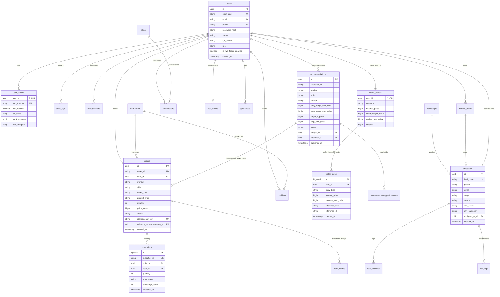
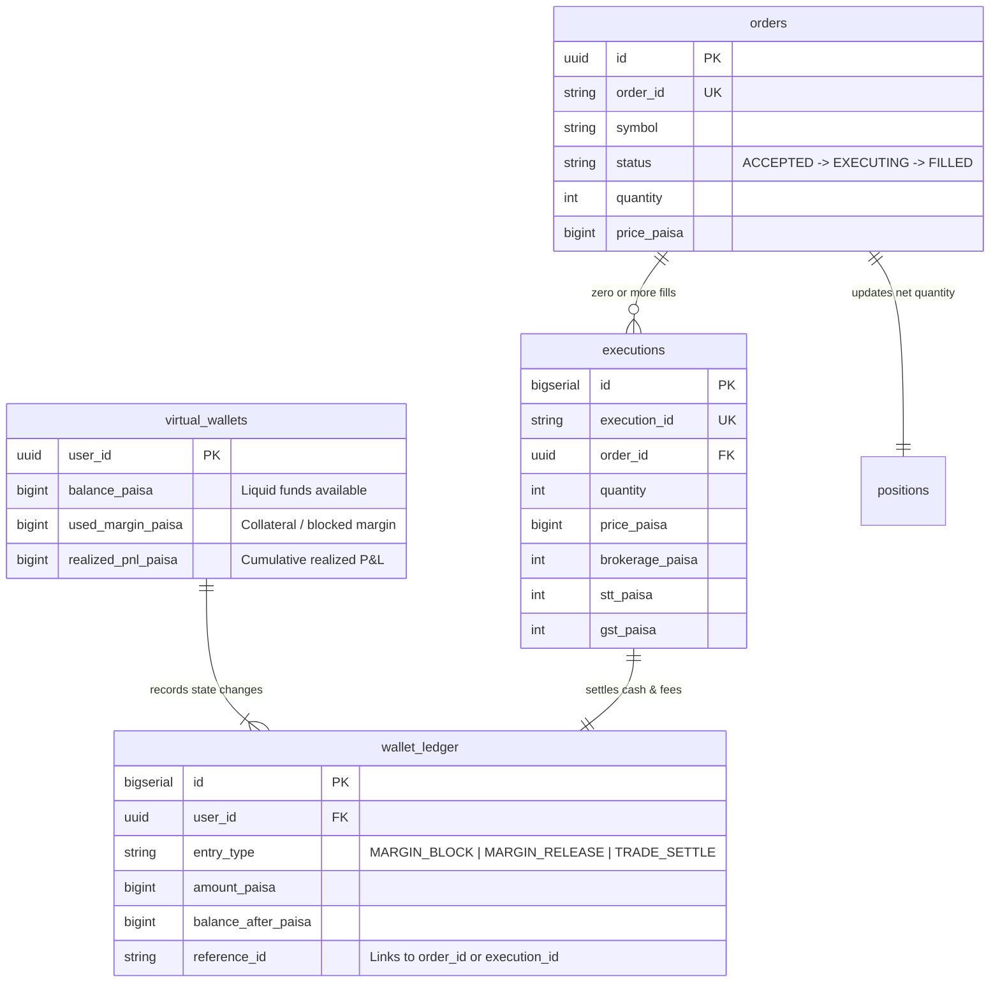
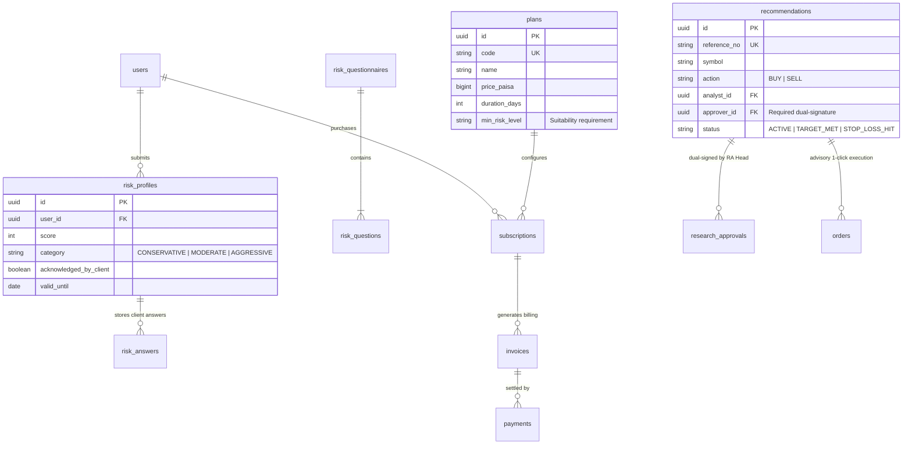
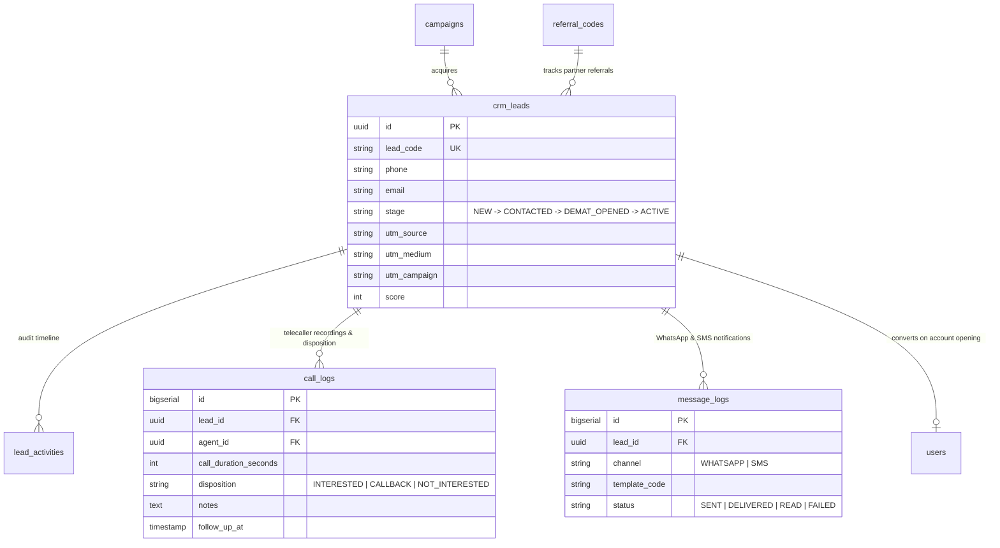

# TradeGrow Unified Platform — Entity Relationship Diagrams (ERD)

**Document Reference**: `docs/database/02_ENTITY_RELATIONSHIP_DIAGRAM.md`  
**Status**: APPROVED BASELINE (Phase 0)  

---

## 1. Master Cross-Domain Entity Relationship Diagram

The unified data model links the **Public Acquisition Funnel**, **Trading Brokerage OMS**, and **SEBI Research Advisory** around a central `core.users` authority:

---

## 2. Brokerage Order Execution & Ledger Sub-ERD

This subsystem governs financial integrity:

---

## 3. SEBI Advisory Governance & Client Journey Sub-ERD

Enforces the regulatory Chinese Wall and client risk suitability requirements:

---

## 4. CRM, Funnel & Multi-Touch Attribution Sub-ERD

Supports Phase 2 (CRM + Funnel), Phase 3 (Attribution), Phase 4 (Referrals), and Phase 5 (WhatsApp):

---
*Entity relationship diagrams certified and saved to [02_ENTITY_RELATIONSHIP_DIAGRAM.md](file:///d:/2026%20C%20downloads/tradegrow%20app/docs/database/02_ENTITY_RELATIONSHIP_DIAGRAM.md).*
